# 📘 DATABASE MANAGEMENT SYSTEMS & MySQL

### 🎯 Comprehensive Theory + SQL Reference

> **Target**: Exam readiness • Interview confidence • Practical SQL skills
> **Coverage**: 8 Units — Theory, SQL, Design & Real-World Applications

---

---

# 🟦 UNIT 1: INTRODUCTION TO DATABASE MANAGEMENT SYSTEMS

---

## 📌 1.1 What is a Database?

### 📘 Definition

- **Data**: Raw, unprocessed facts and figures (e.g., "John", 25, "Mumbai").
- **Information**: Processed, meaningful data (e.g., "John is a 25-year-old student from Mumbai").
- **Database**: An **organized collection of interrelated data** stored and accessed electronically. It is designed to be efficiently managed, updated, and retrieved.

> [!NOTE]
> A database is NOT just a file on a disk. It is a **structured, managed, and queryable** collection of data with rules enforcing integrity and security.

### 📖 Detailed Explanation

#### 🌍 Real-World Analogies

| Analogy | Data | Organization |
|---------|------|-------------|
| 📚 **Library Catalog** | Book titles, authors, ISBNs | Organized by subject, searchable by author/title |
| 🏥 **Hospital Records** | Patient names, diagnoses, prescriptions | Linked to doctors, departments, billing |
| 🏦 **Banking System** | Account numbers, balances, transactions | Linked to customers, branches, loan records |
| 🛒 **E-commerce** | Products, orders, customers | Linked catalogs, cart, payment, delivery |

#### 📁 File System vs Database System

| Feature | 📁 File System | 🗄️ Database System (DBMS) |
|---------|---------------|--------------------------|
| **Data Redundancy** | ❌ High — same data duplicated across files | ✅ Low — centralized, shared data |
| **Data Inconsistency** | ❌ Updates may miss some copies | ✅ Single source of truth |
| **Data Isolation** | ❌ Data scattered in various formats | ✅ Unified, structured format |
| **Concurrent Access** | ❌ Difficult to handle multiple users | ✅ Built-in concurrency control |
| **Security** | ❌ Weak — OS-level file permissions only | ✅ Strong — user-level, table-level access control |
| **Data Integrity** | ❌ Hard to enforce constraints | ✅ Constraints enforced by DBMS (PK, FK, CHECK) |
| **Backup & Recovery** | ❌ Manual | ✅ Automated recovery mechanisms |
| **Data Independence** | ❌ Programs tightly coupled to file structure | ✅ Programs independent of data storage |
| **Query Language** | ❌ No standard — custom programs needed | ✅ SQL — standardized query language |

> [!IMPORTANT]
> The single biggest problem with file systems is **data redundancy leading to inconsistency**. If a customer's address changes, every file containing that address must be updated manually. Miss one file → inconsistent data.

### ✨ Key Points / Highlights
- 📌 Data = raw facts; Information = processed data; Database = organized collection.
- 📌 File systems suffer from **redundancy, inconsistency, isolation, and poor security**.
- 📌 DBMS provides **centralized control**, data integrity, concurrent access, and recovery.
- 📌 A database is **self-describing** — it stores data AND the description of data (metadata/schema).

### 🎯 MCQ Focus Section
- A database is an **organized collection of interrelated data** — not just any collection of files.
- File systems cause **data redundancy** (duplicate data) and **data inconsistency** (conflicting copies).
- **Data isolation** in file systems means data is scattered across different files in different formats.
- **DBMS** provides **data independence** — application programs don't need to change when data storage changes.
- **Metadata** (data about data) is stored in the **data dictionary / system catalog**.
- A DBMS provides **atomicity** for transactions — operations either complete fully or not at all.

---

## 📌 1.2 What is a DBMS?

### 📘 Definition
A **Database Management System (DBMS)** is a **software system** that enables users to **define, create, maintain, and control access** to a database. It acts as an intermediary between users/applications and the physical database.

### 📖 Detailed Explanation

#### 🔧 Functions of a DBMS

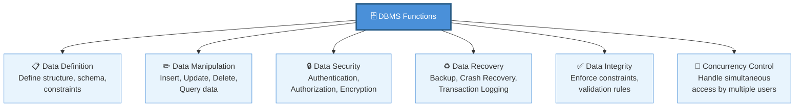

#### ✅ Advantages of DBMS

| Advantage | Explanation |
|-----------|-------------|
| 🔗 **Data Sharing** | Multiple users and applications share the same data |
| ✅ **Data Integrity** | Constraints (PK, FK, CHECK) ensure data accuracy |
| 📉 **Reduced Redundancy** | Centralized storage avoids duplicate data |
| ♻️ **Backup & Recovery** | Automatic mechanisms to recover from failures |
| 🔐 **Security** | Fine-grained access control (user, role, table level) |
| 📊 **Data Independence** | Physical storage can change without affecting applications |
| 🧹 **Data Consistency** | Single source of truth — updates reflect everywhere |

#### ❌ Disadvantages of DBMS

| Disadvantage | Explanation |
|-------------|-------------|
| 💰 **Cost** | DBMS software, hardware, training — all expensive |
| 🔧 **Complexity** | Requires skilled DBAs to design, maintain, and tune |
| ⚡ **Performance Overhead** | DBMS adds layers of abstraction — slight overhead vs. direct file access |
| 🎯 **Single Point of Failure** | If the DBMS crashes, all dependent applications are affected |
| 📦 **Size** | DBMS software itself consumes significant disk and memory |

> [!TIP]
> **Interview Classic**: *"What is the difference between DBMS and RDBMS?"*
> - **DBMS** stores data as files — no relationships enforced between data. Example: XML, file-based systems.
> - **RDBMS** stores data in **tables (relations)** with enforced relationships using **foreign keys**. Supports **ACID** properties. Example: MySQL, PostgreSQL, Oracle.
> - All RDBMS are DBMS, but not all DBMS are RDBMS.

### ✨ Key Points / Highlights
- 📌 DBMS = software to **define, create, maintain, and control** databases.
- 📌 Core functions: definition, manipulation, security, recovery, integrity, concurrency.
- 📌 RDBMS = DBMS that uses **relational model** (tables) and enforces **relationships**.
- 📌 Examples of RDBMS: **MySQL, PostgreSQL, Oracle, SQL Server, SQLite**.

### 🎯 MCQ Focus Section
- A DBMS provides **data abstraction** — hiding storage details from users.
- **DBA (Database Administrator)** is responsible for managing the DBMS, security, backups.
- **Data Dictionary** (System Catalog) stores **metadata** — information about tables, columns, constraints, users.
- DBMS provides **data independence** at two levels: **logical** and **physical**.
- **RDBMS** enforces relationships between tables using **foreign keys**.
- Examples: MySQL, PostgreSQL = **RDBMS**. MongoDB = **NoSQL DBMS**. Excel = **NOT a DBMS**.

---

## 📌 1.3 Types of DBMS

### 📘 Definition
DBMS can be classified based on the **data model** they use to organize and manage data.

### 📖 Detailed Explanation

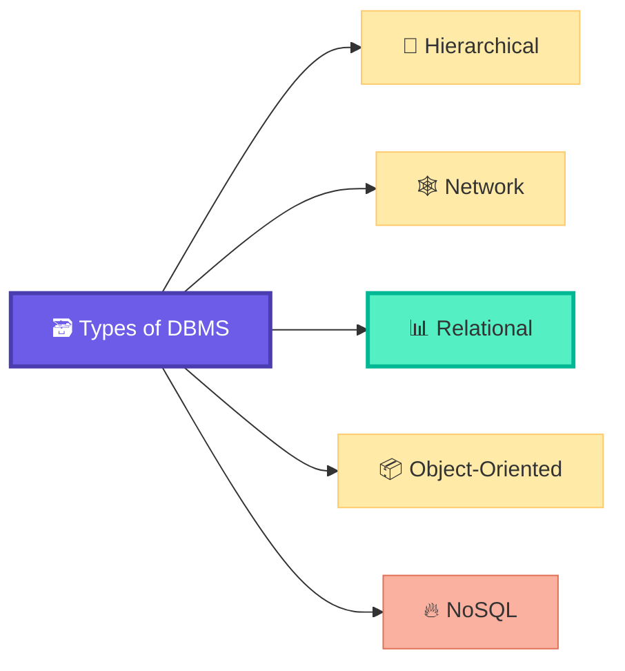

| Type | Structure | Relationships | Example | Era |
|------|-----------|---------------|---------|-----|
| 🌲 **Hierarchical** | Tree (parent-child) | 1:N only | IBM IMS | 1960s |
| 🕸️ **Network** | Graph (many-to-many) | M:N | CODASYL, IDMS | 1970s |
| 📊 **Relational** | Tables (rows & columns) | Via Foreign Keys | MySQL, Oracle, PostgreSQL | 1970s–Present ✅ |
| 📦 **Object-Oriented** | Objects (like OOP classes) | Inheritance, Encapsulation | db4o, ObjectDB | 1990s |
| 🔥 **NoSQL** | Document / Key-Value / Graph / Column | Flexible | MongoDB, Cassandra, Redis | 2000s–Present |

#### 🌲 Hierarchical DBMS
- Data organized in a **tree structure** — one root, branching into children.
- Each child has **exactly one parent** (1:N relationship).
- Fast for predefined queries, poor for ad-hoc queries.
- **Limitation**: Cannot represent **M:N relationships** naturally.

#### 🕸️ Network DBMS
- Data organized as a **graph** — a record can have **multiple parents**.
- Supports **M:N relationships** (overcomes hierarchical limitation).
- Complex pointer-based navigation.

#### 📊 Relational DBMS (RDBMS) — ⭐ Most Important
- Data stored in **tables (relations)** with **rows (tuples)** and **columns (attributes)**.
- Relationships enforced via **foreign keys**.
- Uses **SQL** for querying.
- Based on **Codd's 12 rules** and **relational algebra**.
- **Most widely used** in the industry.

#### 📦 Object-Oriented DBMS (OODBMS)
- Data stored as **objects** (like in Java/Python classes).
- Supports **inheritance, encapsulation, polymorphism**.
- Good for complex data (multimedia, CAD).
- Not widely used in mainstream applications.

#### 🔥 NoSQL DBMS
- "Not Only SQL" — designed for **unstructured/semi-structured** data.
- Types: **Document** (MongoDB), **Key-Value** (Redis), **Column-family** (Cassandra), **Graph** (Neo4j).
- Horizontally scalable — great for **big data and distributed systems**.
- Sacrifices strict ACID for performance and scalability (eventual consistency).

> [!CAUTION]
> NoSQL is NOT a replacement for RDBMS. They solve **different problems**.
> - Need transactions, joins, and strict consistency? → **RDBMS** ✅
> - Need horizontal scaling, flexible schema, high write throughput? → **NoSQL** ✅

### ✨ Key Points / Highlights
- 📌 **Relational DBMS** is the most widely used — based on tables and SQL.
- 📌 Hierarchical = tree (1:N). Network = graph (M:N). Relational = tables (FK-based).
- 📌 NoSQL is for **unstructured data** and **horizontal scaling** — not a replacement for RDBMS.

### 🎯 MCQ Focus Section
- **Hierarchical DBMS** uses a **tree structure** — each child has **one parent**.
- **Network DBMS** supports **many-to-many** relationships.
- **RDBMS** is based on **Codd's Relational Model** (1970) — data stored in **tables**.
- **E.F. Codd** proposed the relational model.
- **NoSQL** stands for "**Not Only SQL**".
- **MongoDB** is a **document-based** NoSQL database.
- **Redis** is a **key-value** store.
- **Neo4j** is a **graph** database.
- **RDBMS** uses **SQL**; NoSQL databases have their own query languages.

---

## 📌 1.4 Key Terminology

### 📘 Definition
Essential vocabulary for understanding relational databases and database theory.

### 📖 Detailed Explanation

#### 🏗️ Core Terms

| Term | Definition | Example |
|------|-----------|---------|
| **Entity** | A real-world object or concept | Student, Course, Employee |
| **Attribute** | A property of an entity | Name, Age, Salary |
| **Tuple** | A single row in a table | (101, "John", 25, "CS") |
| **Relation** | A table — a set of tuples | Students table |
| **Schema** | The **structure/blueprint** of a database (table definitions, constraints) — does NOT change frequently | `Students(ID, Name, Age, Dept)` |
| **Instance** | The **actual data** in the database at a particular moment — changes frequently | All current rows in the Students table |
| **Domain** | The set of allowed values for an attribute | Age: {1-150}, Gender: {M, F, Other} |
| **Degree** | Number of **attributes (columns)** in a relation | A table with 5 columns → degree = 5 |
| **Cardinality** | Number of **tuples (rows)** in a relation | A table with 100 rows → cardinality = 100 |

#### 🔑 Types of Keys

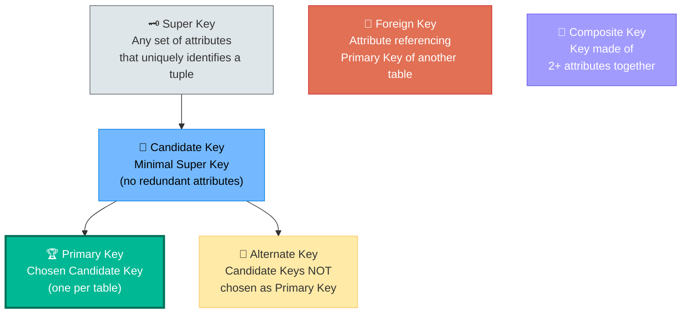

| Key Type | Definition | Example (Students Table) |
|----------|-----------|--------------------------|
| 🗝️ **Super Key** | Any combination of attributes that **uniquely identifies** a tuple | {ID}, {ID, Name}, {ID, Name, Age}, {Email} |
| 🔑 **Candidate Key** | **Minimal** super key — remove any attribute and it's no longer unique | {ID}, {Email} |
| 🏆 **Primary Key** | The **chosen** candidate key — one per table, cannot be NULL | {ID} ← chosen |
| 🔄 **Alternate Key** | Candidate keys that were **NOT chosen** as the primary key | {Email} |
| 🔗 **Foreign Key** | An attribute that **references** the primary key of **another** table | `Dept_ID` in Students referencing `ID` in Departments |
| 🧩 **Composite Key** | A key made of **two or more attributes** together | {Student_ID, Course_ID} in Enrollment table |

> [!TIP]
> **Key Hierarchy**: Super Key ⊇ Candidate Key ⊇ Primary Key.
> Every primary key is a candidate key. Every candidate key is a super key. But NOT vice versa.

### ✨ Key Points / Highlights
- 📌 **Schema** = structure (fixed). **Instance** = data (changes).
- 📌 **Degree** = number of columns. **Cardinality** = number of rows.
- 📌 **Primary Key** = unique + NOT NULL. Only **one** per table.
- 📌 **Foreign Key** creates a **link** between two tables — enforces referential integrity.

### 🎯 MCQ Focus Section
- **Super Key** = any set of attributes that ensures uniqueness. **Candidate Key** = minimal super key.
- A table can have **multiple candidate keys** but only **one primary key**.
- A **primary key** cannot contain **NULL** values.
- A **foreign key** can contain **NULL** (unless explicitly constrained).
- **Degree** = columns; **Cardinality** = rows (remember: **D**egree = **D**ownward/columns is wrong — Degree = attributes across).
- **Composite key** is needed when no single attribute is unique (e.g., Enrollment: Student_ID + Course_ID).
- **Alternate key** = candidate key − primary key.
- A **domain** is the set of **permissible values** for an attribute.

---

## 📌 1.5 DBMS Architecture

### 📘 Definition
DBMS architecture describes the **structure** of a DBMS system — how users interact with the database, how data is organized internally, and how these layers are separated to provide **data independence**.

### 📖 Detailed Explanation

#### 🏢 Tier Architecture

| Architecture | Description | Example |
|-------------|-------------|---------|
| **1-Tier** | User directly interacts with the database (single machine) | Local SQLite database on a phone |
| **2-Tier** | Client application communicates directly with the database server | Desktop app ↔ MySQL Server |
| **3-Tier** | Client → Application Server → Database Server (web model) | Browser → Node.js API → MySQL |

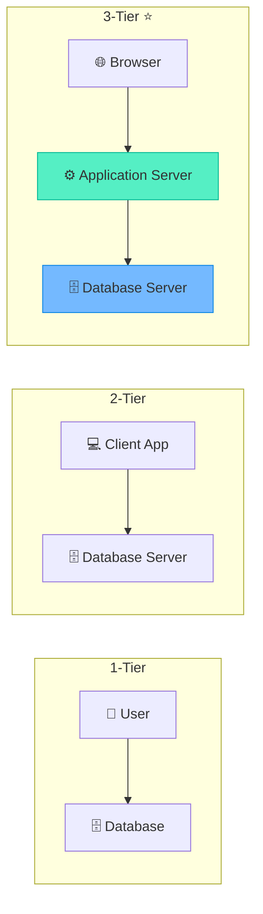

> [!IMPORTANT]
> **3-Tier architecture** is the industry standard for web applications. It provides **separation of concerns**: Presentation (UI) → Business Logic (Server) → Data (Database).

#### 🏛️ Three-Schema Architecture (ANSI-SPARC)

This architecture defines **three levels of abstraction** to provide data independence.

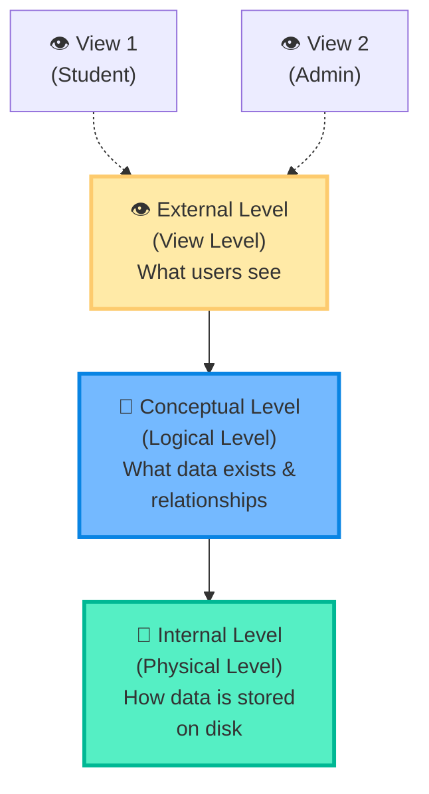

| Level | Also Called | What It Defines | Who Uses It |
|-------|-----------|-----------------|-------------|
| 👁️ **External** | View Level | Individual user **views** — each user sees only relevant data | End Users, Applications |
| 📐 **Conceptual** | Logical Level | Overall **structure** of the entire database — tables, relationships, constraints | DBA, Database Designers |
| 💾 **Internal** | Physical Level | **Storage details** — file organization, indexing, compression, disk blocks | Storage/System Admins |

#### 🔓 Data Independence

| Type | Definition | Example |
|------|-----------|---------|
| **Logical Data Independence** | Changes to the **conceptual schema** don't affect **external views** | Adding a new column doesn't break existing applications |
| **Physical Data Independence** | Changes to the **internal schema** don't affect the **conceptual schema** | Moving database to SSD doesn't change table structure |

> [!NOTE]
> **Physical data independence** is **easier to achieve** than logical data independence. Changing storage is simpler than changing the logical structure of data.

### ✨ Key Points / Highlights
- 📌 **3-Tier** (Client → App Server → DB) is the standard web architecture.
- 📌 Three-Schema: **External** (views) → **Conceptual** (logical) → **Internal** (physical).
- 📌 **Logical independence** = changing schema without breaking views.
- 📌 **Physical independence** = changing storage without breaking schema.

### 🎯 MCQ Focus Section
- **3-Tier architecture** provides **better security** because clients never directly access the database.
- The **ANSI-SPARC** model defines the three-schema architecture.
- **External schema** = user views. **Conceptual schema** = logical design. **Internal schema** = physical storage.
- **Physical data independence** is easier to achieve than logical.
- The **conceptual schema** is maintained by the **DBA**.
- **Mapping** between levels is done by the DBMS: External↔Conceptual mapping, Conceptual↔Internal mapping.
- Adding a new **index** (faster search) is a change at the **internal level** — does NOT affect conceptual or external levels.

---

---

# 🟩 UNIT 2: ENTITY-RELATIONSHIP (ER) MODEL & DATABASE DESIGN

---

## 📌 2.1 ER Model Basics

### 📘 Definition
The **Entity-Relationship (ER) Model** is a **high-level conceptual data model** used to describe the structure of a database graphically. It is the **blueprint** created before building the actual database — like an architect's drawing before constructing a building.

### 📖 Detailed Explanation

#### 🏗️ Purpose
- Visualize the database design **before implementation**.
- Communicate the structure to **stakeholders** (non-technical people can understand ER diagrams).
- Identify **entities, attributes, and relationships** in the real world.
- Serves as the basis for creating the **relational schema** (tables).

#### 🟦 Entities

| Type | Definition | Symbol | Example |
|------|-----------|--------|---------|
| **Strong Entity** | Exists **independently** — has its own primary key | 🟦 Rectangle | Student, Employee, Product |
| **Weak Entity** | **Cannot exist** without a related strong entity — has a **partial key** | 🟦🟦 Double Rectangle | Dependent (needs Employee), Payment (needs Order) |

> [!NOTE]
> A **weak entity** depends on a **strong entity** (called the **owner entity**) for its existence. It is identified by the combination of its **partial key** + the **primary key of the owner entity**.
> Example: `Dependent` is identified by `Dependent_Name` + `Employee_ID` (from Employee).

#### 🟡 Attributes

| Type | Definition | Symbol | Example |
|------|-----------|--------|---------|
| **Simple** | Cannot be divided further | 🟡 Ellipse | Age, Salary |
| **Composite** | Can be divided into sub-attributes | 🟡 Ellipse with branches | Name → (First, Middle, Last) |
| **Derived** | Computed from other attributes (not stored) | 🟡 Dashed Ellipse | Age (derived from DOB) |
| **Multi-valued** | Can have multiple values | 🟡🟡 Double Ellipse | Phone Numbers, Email Addresses |
| **Key Attribute** | Uniquely identifies the entity | 🟡 Underlined Ellipse | Student_ID, Employee_ID |

#### 🔷 Relationships

| Type | Involves | Example |
|------|----------|---------|
| **Unary** (Recursive) | One entity with itself | Employee **manages** Employee |
| **Binary** | Two entities | Student **enrolls in** Course |
| **Ternary** | Three entities | Doctor **prescribes** Medicine **to** Patient |

#### Participation Constraints

| Type | Meaning | Line Style |
|------|---------|-----------|
| **Total Participation** | **Every** instance of the entity MUST participate | ═══ Double line |
| **Partial Participation** | Some instances may NOT participate | ─── Single line |

> [!TIP]
> **Total participation** = "must." **Partial participation** = "may."
> Example: Every `Dependent` **must** belong to an `Employee` (total). But not every `Employee` **must** have a `Dependent` (partial).

### ✨ Key Points / Highlights
- 📌 ER Model = **blueprint** before building the database.
- 📌 **Strong entity** has its own PK. **Weak entity** depends on a strong entity.
- 📌 Attribute types: Simple, Composite, Derived, Multi-valued, Key.
- 📌 Relationship types: Unary, Binary, Ternary.
- 📌 Total participation = every entity instance must participate.

### 🎯 MCQ Focus Section
- A **weak entity** has a **partial key** (also called **discriminator**).
- A weak entity has **total participation** in its identifying relationship.
- A **derived attribute** is shown with a **dashed ellipse** in ER diagrams.
- A **multi-valued attribute** is shown with a **double ellipse**.
- A **composite attribute** has **sub-attributes** branching from it.
- **Unary (recursive) relationship** = an entity related to **itself**.
- The relationship between a weak and strong entity is called an **identifying relationship** (shown with double diamond).

---

## 📌 2.2 ER Diagram Notation

### 📘 Definition
ER Diagrams use a standard set of **symbols** to visually represent entities, attributes, relationships, and cardinalities.

### 📖 Detailed Explanation

#### 🎨 Standard Symbols

| Component | Symbol | Notation |
|-----------|--------|----------|
| **Strong Entity** | Rectangle | `[Student]` |
| **Weak Entity** | Double Rectangle | `[[Dependent]]` |
| **Attribute** | Ellipse | `(Name)` |
| **Key Attribute** | Underlined Ellipse | `(_ID_)` |
| **Multi-valued Attribute** | Double Ellipse | `((Phone))` |
| **Derived Attribute** | Dashed Ellipse | `(..Age..)` |
| **Composite Attribute** | Ellipse with sub-ellipses | `(Name) → (First)(Last)` |
| **Relationship** | Diamond | `<Enrolls>` |
| **Identifying Relationship** | Double Diamond | `<<Has>>` (weak entity) |
| **Total Participation** | Double Line | ═══ |
| **Partial Participation** | Single Line | ─── |

#### 📊 Cardinality Ratios

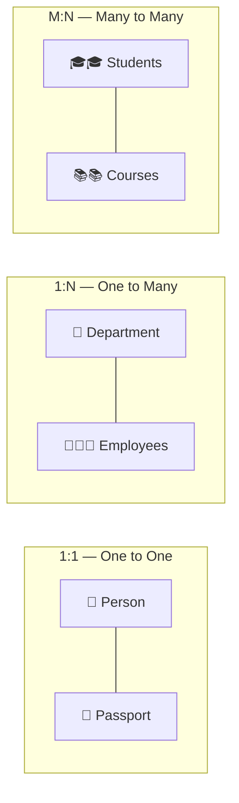

| Cardinality | Meaning | Example | Foreign Key Placement |
|-------------|---------|---------|----------------------|
| **1:1** | One entity related to exactly one of the other | Person ↔ Passport | FK in **either** table |
| **1:N** | One entity related to many of the other | Department → many Employees | FK in the **"many" side** table |
| **M:N** | Many of one related to many of the other | Students ↔ Courses | Create a **junction/bridge table** |

> [!IMPORTANT]
> **M:N relationships** cannot be directly implemented in a relational database. They MUST be resolved using a **junction table** (also called bridge, associative, or linking table).
>
> Example: `Enrollment(Student_ID, Course_ID, Grade)` — the junction table for Students ↔ Courses.

### ✨ Key Points / Highlights
- 📌 Rectangle = Entity, Ellipse = Attribute, Diamond = Relationship.
- 📌 Double shapes = weak entity / multi-valued / identifying relationship.
- 📌 Dashed ellipse = derived attribute.
- 📌 **1:N** = FK goes in the "many" side. **M:N** = junction table.

### 🎯 MCQ Focus Section
- In a **1:1** relationship, FK can go in **either** table (prefer total participation side).
- In a **1:N** relationship, FK goes in the **N side** (many side).
- **M:N** relationship requires a **junction table** with two foreign keys.
- **Cardinality** specifies the **number** of instances in a relationship (1:1, 1:N, M:N).
- **Participation** specifies whether participation is **mandatory (total)** or **optional (partial)**.

---

## 📌 2.3 Extended ER (EER) Model

### 📘 Definition
The **Extended ER (EER) Model** adds advanced concepts to the basic ER model to handle **more complex data relationships** — including generalization, specialization, aggregation, and inheritance.

### 📖 Detailed Explanation

#### 🔺 Generalization
- **Bottom-up** approach: Combining multiple **lower-level entities** into a **higher-level entity**.
- Identifying **common attributes** and creating a parent entity.
- Example: `Car`, `Truck`, `Bike` → generalized to `Vehicle`.

#### 🔻 Specialization
- **Top-down** approach: Splitting a **higher-level entity** into **lower-level sub-entities** based on distinguishing features.
- Example: `Employee` → specialized into `Full-Time`, `Part-Time`, `Intern`.

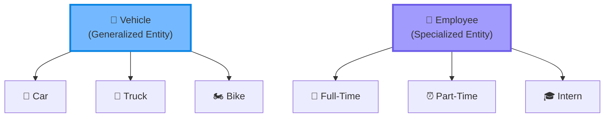

#### 📦 Aggregation
- Treats a **relationship** as a **higher-level entity** — so that another relationship can be defined on it.
- Used when a relationship needs to participate in another relationship.
- Example: The relationship `Employee works_on Project` is aggregated, and then `Manager monitors (Employee-works_on-Project)`.

#### 🧬 Inheritance Constraints

| Constraint | Meaning |
|-----------|---------|
| **Disjoint (d)** | An entity can belong to **at most one** sub-entity. Example: A person is either Faculty OR Student, not both |
| **Overlapping (o)** | An entity can belong to **multiple** sub-entities. Example: A person can be both a Student AND a Teaching Assistant |
| **Total** | **Every** instance of the parent must belong to at least one sub-entity |
| **Partial** | Some instances of the parent may **not** belong to any sub-entity |

> [!NOTE]
> **Disjoint + Total** = every parent entity belongs to **exactly one** subtype (most restrictive).
> **Overlapping + Partial** = some parents may not specialize, and those that do can belong to multiple subtypes (most flexible).

### ✨ Key Points / Highlights
- 📌 **Generalization** = bottom-up (combine). **Specialization** = top-down (divide).
- 📌 **Aggregation** treats a relationship as a higher-level entity.
- 📌 **Disjoint** = mutually exclusive subtypes. **Overlapping** = can belong to multiple.

### 🎯 MCQ Focus Section
- **Generalization** is **bottom-up**; **Specialization** is **top-down**.
- Both generalization and specialization represent **IS-A** relationships.
- **Aggregation** is used when a relationship needs to participate in **another relationship**.
- **Disjoint** constraint: entity belongs to **at most one** subclass.
- **Overlapping** constraint: entity can belong to **multiple** subclasses.
- **Total specialization**: every entity in the superclass **must** belong to a subclass.
- **Attribute inheritance**: subclasses inherit all attributes of the superclass.

---

## 📌 2.4 ER to Relational Mapping

### 📘 Definition
**ER to Relational Mapping** is the process of converting an ER diagram into **relational tables (schemas)** that can be implemented in a RDBMS.

### 📖 Detailed Explanation

#### 📋 Mapping Rules

| ER Component | Mapping Rule | Result |
|-------------|-------------|--------|
| **Strong Entity** | Create a **table** with all simple attributes. Composite → use sub-attributes. Primary key = key attribute | `Students(ID, Name, Age, Dept)` |
| **Weak Entity** | Create a table. PK = **partial key + FK** (owner's PK) | `Dependents(Emp_ID, Dep_Name, Relation)` PK = (Emp_ID, Dep_Name) |
| **1:1 Relationship** | Add FK in **either** table (prefer total participation side). Or merge into one table | `Person(ID, Name, Passport_No)` |
| **1:N Relationship** | Add FK in the **N-side** table | `Employees(ID, Name, Dept_ID FK)` |
| **M:N Relationship** | Create a **junction table** with FKs from both entities as composite PK | `Enrollment(Stu_ID, Course_ID, Grade)` |
| **Multi-valued Attribute** | Create a **separate table** with FK referencing the owner entity | `Phone_Numbers(Emp_ID, Phone)` PK = (Emp_ID, Phone) |
| **Derived Attribute** | **Do NOT store** — compute at query time (or store if performance-critical) | `Age` derived from `DOB` — not mapped |
| **Composite Attribute** | Store only the **leaf (atomic) sub-attributes** | `Name` → stored as `First_Name`, `Last_Name` |

#### 🔄 Example: University Database Mapping

```
ER Entities:
  Student (Student_ID, Name, DOB, Phone[multi])
  Course (Course_ID, Title, Credits)
  Faculty (Faculty_ID, Name, Rank)
  
ER Relationships:
  Student --enrolls_in--> Course  (M:N)
  Faculty --teaches--> Course (1:N)
  
Mapped Tables:
  ┌─────────────────────────────────────────────┐
  │ Students(Student_ID PK, First_Name,         │
  │          Last_Name, DOB)                     │
  │ Student_Phones(Student_ID FK, Phone) PK=both │
  │ Courses(Course_ID PK, Title, Credits,        │
  │         Faculty_ID FK)                       │
  │ Faculty(Faculty_ID PK, First_Name,           │
  │         Last_Name, Rank)                     │
  │ Enrollment(Student_ID FK, Course_ID FK,      │
  │            Grade) PK=(Student_ID, Course_ID)  │
  └─────────────────────────────────────────────┘
```

> [!WARNING]
> **Common Mistake**: Forgetting to create a separate table for **multi-valued attributes**. You CANNOT store multiple phone numbers in a single column in a relational database (violates 1NF).

### ✨ Key Points / Highlights
- 📌 Strong entity → table with its attributes and PK.
- 📌 Weak entity → table with partial key + owner's PK as composite PK.
- 📌 1:N → FK in the "many" side table.
- 📌 M:N → junction table with composite FK-based PK.
- 📌 Multi-valued attribute → separate table.
- 📌 Derived attribute → NOT stored (computed).

### 🎯 MCQ Focus Section
- A **weak entity** table's primary key = **partial key + FK of owner entity**.
- In **1:1** mapping, place FK on the side with **total participation** (to avoid NULLs).
- In **1:N** mapping, FK always goes in the **N-side table**.
- **M:N** mapping creates a **new table** (junction table).
- **Multi-valued attributes** always require a **separate table**.
- **Composite attributes** are mapped by storing their **atomic components** only.
- **Derived attributes** are generally **not mapped** to columns.
- A junction table's PK is typically the **composite of both FKs**.

---

---

# 🟨 UNIT 3: RELATIONAL MODEL & RELATIONAL ALGEBRA

---

## 📌 3.1 Relational Model Concepts

### 📘 Definition
The **Relational Model**, proposed by **E.F. Codd** in 1970, organizes data into **relations (tables)** consisting of **tuples (rows)** and **attributes (columns)**. It is the mathematical foundation of RDBMS.

### 📖 Detailed Explanation

#### 📊 Terminology Mapping

| Formal Term | Common Term | Meaning |
|-------------|------------|---------|
| **Relation** | Table | A set of tuples with the same attributes |
| **Tuple** | Row / Record | A single entry in a table |
| **Attribute** | Column / Field | A named property of a relation |
| **Domain** | Data Type | Set of allowed values for an attribute |
| **Relational Schema** | Table Structure | Name + list of attributes + their domains |
| **Relational Instance** | Table Data | The current set of tuples in a relation |

#### ⚖️ Integrity Constraints

| Constraint | Rule | Violation Example |
|-----------|------|-------------------|
| 🔑 **Entity Integrity** | Primary key **cannot be NULL** — every tuple must be uniquely identifiable | Student_ID = NULL ❌ |
| 🔗 **Referential Integrity** | A foreign key must either be **NULL** or match a **valid primary key** in the referenced table | Dept_ID = 999 in Employee, but no Dept with ID 999 exists ❌ |
| 📋 **Domain Integrity** | Attribute values must belong to the **defined domain** | Age = "twenty-five" in an INT column ❌ |
| 🔒 **Key Integrity** | No two tuples can have the **same primary key value** | Two students with ID = 101 ❌ |

> [!IMPORTANT]
> **Entity Integrity**: PK ≠ NULL (ever).
> **Referential Integrity**: FK must reference a valid PK or be NULL.
> These two are the **most tested** integrity rules in exams and interviews.

#### ❓ NULL Values
- **NULL** = unknown / missing / not applicable. It is **NOT zero** and **NOT empty string**.
- Any comparison with NULL returns **UNKNOWN** (not TRUE or FALSE).
- `NULL = NULL` → **UNKNOWN** (not TRUE!).
- Use `IS NULL` or `IS NOT NULL` to check.
- Aggregate functions (except `COUNT(*)`) **ignore** NULLs.

### ✨ Key Points / Highlights
- 📌 Relation = table, Tuple = row, Attribute = column.
- 📌 **Entity Integrity**: PK cannot be NULL.
- 📌 **Referential Integrity**: FK must match a valid PK or be NULL.
- 📌 NULL ≠ 0 ≠ empty string. NULL = **unknown**.

### 🎯 MCQ Focus Section
- A **relation** is a **set of tuples** — no duplicate tuples allowed.
- Tuples in a relation have **no inherent order** (set theory).
- **NULL** is not equal to anything — even **NULL ≠ NULL**.
- **Entity integrity** applies to **primary keys**. **Referential integrity** applies to **foreign keys**.
- `COUNT(*)` counts **all rows** including NULLs. `COUNT(column)` skips NULLs.
- A relation with no tuples is still a **valid relation** (empty set).
- The relational model was proposed by **E.F. Codd** in **1970** at **IBM**.

---

## 📌 3.2 Keys in the Relational Model

### 📘 Definition
**Keys** are attributes (or sets of attributes) used to **uniquely identify tuples** in a relation, establish **relationships** between relations, and enforce **integrity constraints**.

### 📖 Detailed Explanation

> *Refer to Section 1.4 for detailed key definitions. This section focuses on deeper analysis and exam-critical nuances.*

#### 🔍 Finding Candidate Keys from Functional Dependencies

**Step-by-step approach:**
1. Identify attributes that appear **only on the LEFT side** of FDs → must be part of every candidate key.
2. Identify attributes that appear **only on the RIGHT side** → never part of any candidate key.
3. Identify attributes that appear on **neither side** → must be part of every candidate key.
4. Start with the must-have attributes. Compute their **closure**. If closure = all attributes → that's a candidate key. If not, add attributes one at a time and check again.

#### 🔗 Foreign Key and Referential Integrity — Deep Dive

```sql
-- Parent table
CREATE TABLE Departments (
    Dept_ID INT PRIMARY KEY,
    Dept_Name VARCHAR(100)
);

-- Child table with Foreign Key
CREATE TABLE Employees (
    Emp_ID INT PRIMARY KEY,
    Name VARCHAR(100),
    Dept_ID INT,
    FOREIGN KEY (Dept_ID) REFERENCES Departments(Dept_ID)
        ON DELETE CASCADE      -- If department deleted, delete its employees
        ON UPDATE SET NULL     -- If department ID changes, set employee's dept to NULL
);
```

**Referential Actions:**

| Action | On DELETE | On UPDATE |
|--------|----------|-----------|
| `CASCADE` | Delete child rows | Update child FK values |
| `SET NULL` | Set child FK to NULL | Set child FK to NULL |
| `SET DEFAULT` | Set child FK to default | Set child FK to default |
| `RESTRICT` / `NO ACTION` | **Block** the delete/update | **Block** the update |

> [!CAUTION]
> `ON DELETE CASCADE` is powerful but **dangerous**. Deleting a department will silently delete ALL employees in that department. Use with extreme caution in production databases.

### ✨ Key Points / Highlights
- 📌 **Super Key** ⊇ **Candidate Key** ⊇ **Primary Key**.
- 📌 Foreign keys enforce **referential integrity** between tables.
- 📌 **Referential actions**: CASCADE, SET NULL, SET DEFAULT, RESTRICT.

### 🎯 MCQ Focus Section
- A table can have **multiple candidate keys** but only **one primary key**.
- A **foreign key** can reference only a **primary key or unique key** in the referenced table.
- `ON DELETE CASCADE` = deleting parent → deletes children.
- `ON DELETE SET NULL` = deleting parent → children's FK becomes NULL.
- `ON DELETE RESTRICT` = **blocks** deletion of parent if children exist.
- A foreign key column **can have NULL** values (unless explicitly NOT NULL).
- **Self-referencing FK**: A table can have a FK that points to its own PK (e.g., Employee.Manager_ID → Employee.Emp_ID).

---

## 📌 3.3 Relational Algebra

### 📘 Definition
**Relational Algebra** is a **procedural query language** that consists of a set of operations on relations (tables). Each operation takes one or two relations as input and produces a **new relation** as output. It forms the **mathematical foundation of SQL**.

### 📖 Detailed Explanation

#### 🔧 Unary Operations (One relation as input)

| Operation | Symbol | Purpose | SQL Equivalent |
|-----------|--------|---------|----------------|
| **Selection** | σ (sigma) | Filter **rows** based on a condition | `WHERE` |
| **Projection** | π (pi) | Select specific **columns** (removes duplicates) | `SELECT DISTINCT col1, col2` |
| **Rename** | ρ (rho) | Rename a relation or its attributes | `AS` |

```
σ_(Age > 20)(Students)        → SELECT * FROM Students WHERE Age > 20;
π_(Name, Dept)(Students)      → SELECT DISTINCT Name, Dept FROM Students;
ρ_(S)(Students)                → Students AS S;
```

> [!TIP]
> 🔑 Memory Trick:
> - σ (**S**election) = filter row**S** (horizontal cut ═══)
> - π (**P**rojection) = pick columns/**P**roperties (vertical cut ║)

#### 🔧 Binary Operations (Two relations as input)

| Operation | Symbol | Purpose | Condition |
|-----------|--------|---------|-----------|
| **Union** | ∪ | Combine all tuples from both relations (no duplicates) | Must be **union-compatible** (same degree, same domains) |
| **Intersection** | ∩ | Tuples present in **both** relations | Union-compatible |
| **Difference** | − | Tuples in R1 but **not in** R2 | Union-compatible |
| **Cartesian Product** | × | Every tuple of R1 paired with every tuple of R2 | No condition needed |

```
R1 ∪ R2  → UNION
R1 ∩ R2  → INTERSECT  (or use INNER JOIN / EXISTS)
R1 − R2  → EXCEPT     (MySQL: use LEFT JOIN ... WHERE IS NULL)
R1 × R2  → CROSS JOIN (or FROM R1, R2)
```

> [!WARNING]
> **Cartesian Product** produces |R1| × |R2| tuples. If R1 has 100 rows and R2 has 200 rows, the result has **20,000 rows**! Almost never useful alone — always combine with a **selection (σ)** condition (which gives you a JOIN).

#### 🔗 Join Operations

| Join Type | Symbol | Description | SQL |
|-----------|--------|-------------|-----|
| **Theta Join** | ⋈_θ | Cartesian Product + Selection on condition θ | `JOIN ... ON condition` |
| **Equi-Join** | ⋈ | Theta Join where θ uses only `=` | `JOIN ... ON R1.A = R2.B` |
| **Natural Join** | ⋈ | Equi-join on **all common attributes** + remove duplicate columns | `NATURAL JOIN` |
| **Left Outer Join** | ⟕ | All rows from left + matching from right (NULL if no match) | `LEFT JOIN` |
| **Right Outer Join** | ⟖ | All rows from right + matching from left | `RIGHT JOIN` |
| **Full Outer Join** | ⟗ | All rows from both + NULLs where no match | `FULL OUTER JOIN` (MySQL: UNION of LEFT + RIGHT) |

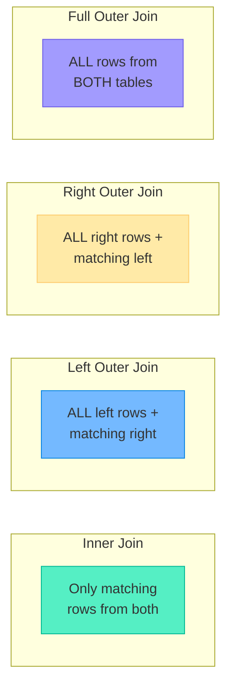

#### ➗ Division Operation
- Used for **"for all"** queries: "Find students who enrolled in **all** courses."
- `R ÷ S` = tuples in R that are associated with **every** tuple in S.
- **No direct SQL equivalent** — must be implemented using NOT EXISTS + subqueries.

### ✨ Key Points / Highlights
- 📌 **σ (selection)** = filter rows. **π (projection)** = pick columns.
- 📌 **Union, Intersection, Difference** require union-compatible relations.
- 📌 **Cartesian Product** × **Selection** = **Join**.
- 📌 Natural Join automatically matches on **common attribute names**.
- 📌 **Division** answers "for all" queries.

### 🎯 MCQ Focus Section
- **Selection (σ)** is a **horizontal** operation (filters rows). **Projection (π)** is **vertical** (selects columns).
- **Projection** removes **duplicate tuples** from the result.
- Two relations are **union-compatible** if they have the **same number of attributes** and **corresponding domains match**.
- **Natural Join** = Equi-join on all common attributes + removes duplicate columns.
- **Cartesian Product** of m rows and n rows = **m × n** rows.
- **Division** is used for universal quantifier queries ("for all").
- Relational algebra is **procedural** — you specify **how** to get the result.
- **Relational algebra** is **closed** — every operation produces a **relation** (composable).
- **Join** = Cartesian Product + Selection.
- **Theta Join**: condition can use any comparison operator (=, <, >, ≤, ≥, ≠). **Equi-Join**: only `=`.

---

## 📌 3.4 Relational Calculus (Overview)

### 📘 Definition
**Relational Calculus** is a **non-procedural (declarative)** query language. You describe **what** you want without specifying **how** to get it. It has the same expressive power as relational algebra.

### 📖 Detailed Explanation

#### 📝 Tuple Relational Calculus (TRC)
- Variables range over **tuples** (rows).
- Form: `{ t | P(t) }` — "the set of all tuples t such that predicate P is true."
- Example: `{ t | t ∈ Students ∧ t.Age > 20 }` → "All student tuples where age > 20."

#### 📝 Domain Relational Calculus (DRC)
- Variables range over **domains** (individual attribute values).
- Form: `{ <x1, x2, ...> | P(x1, x2, ...) }` — values from domains satisfying P.
- Example: `{ <n, a> | ∃d (Students(n, a, d) ∧ a > 20) }` → "Name and age where age > 20."

#### ⚖️ Relational Algebra vs Relational Calculus

| Feature | Relational Algebra | Relational Calculus |
|---------|-------------------|-------------------|
| **Type** | **Procedural** — specifies HOW | **Declarative** — specifies WHAT |
| **Approach** | Step-by-step operations | Describe the desired result |
| **Power** | Equivalent | Equivalent |
| **Basis for** | Query execution engine | SQL (inspired by) |
| **Closer to** | Execution plan | SQL syntax |

> [!NOTE]
> **Codd's Theorem**: Relational Algebra and Relational Calculus are **equivalent in expressive power** — anything that can be expressed in one can be expressed in the other. A query language is said to be **relationally complete** if it can express everything that relational algebra can.

### ✨ Key Points / Highlights
- 📌 **TRC**: Variables = tuples. **DRC**: Variables = domain values.
- 📌 Relational Algebra = procedural. Relational Calculus = declarative.
- 📌 Both have **equal expressive power** (Codd's Theorem).
- 📌 **SQL** is based on **Tuple Relational Calculus** (with some algebra concepts).

### 🎯 MCQ Focus Section
- **TRC** uses **tuple variables**; **DRC** uses **domain variables**.
- Relational Calculus is **non-procedural / declarative**.
- **SQL** is primarily inspired by **Tuple Relational Calculus (TRC)**.
- A language is **relationally complete** if it can express everything that **relational algebra** can.
- Relational algebra and calculus are **equivalent** (Codd's Theorem).
- **Unsafe** calculus expressions may produce **infinite** results — must be restricted to **safe** expressions.

---

---

# 🟧 UNIT 4: STRUCTURED QUERY LANGUAGE (SQL) — CORE

---

## 📌 4.1 Introduction to SQL & MySQL Setup

### 📘 Definition
**SQL (Structured Query Language)** is the standard language for **creating, managing, and querying** relational databases. It is **declarative** — you describe *what* you want, not *how* to get it.

### 📖 Detailed Explanation

#### 📜 SQL History
| Standard | Year | Key Additions |
|----------|------|---------------|
| SQL-86 | 1986 | First ANSI standard |
| SQL-92 | 1992 | JOINs, CASE, CAST, subqueries |
| SQL:1999 | 1999 | Triggers, CTEs, recursive queries |
| SQL:2003 | 2003 | Window functions, XML |
| SQL:2016 | 2016 | JSON support, row pattern matching |

#### 🗂️ SQL Command Categories

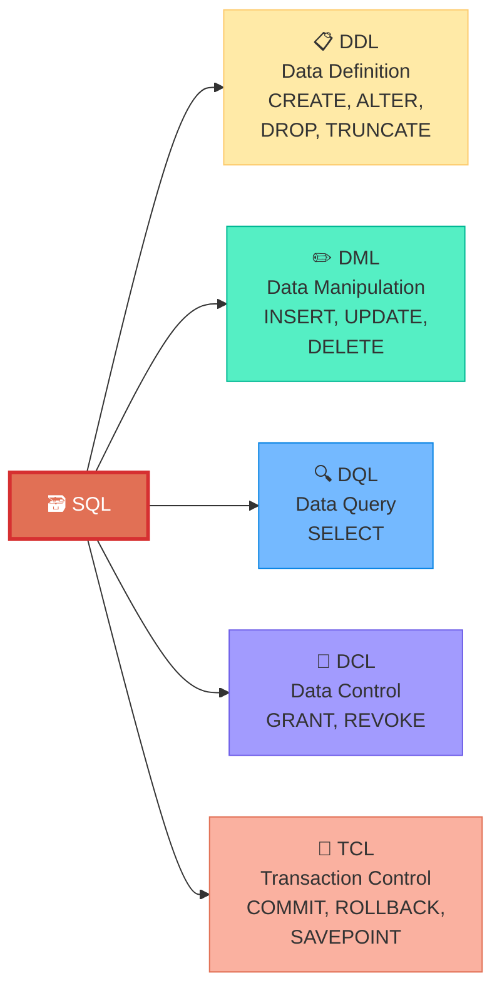

| Category | Full Form | Commands | Auto-Commit? |
|----------|-----------|----------|-------------|
| **DDL** | Data Definition Language | `CREATE`, `ALTER`, `DROP`, `TRUNCATE` | ✅ Yes (auto-commit) |
| **DML** | Data Manipulation Language | `INSERT`, `UPDATE`, `DELETE` | ❌ No (can be rolled back) |
| **DQL** | Data Query Language | `SELECT` | N/A (read-only) |
| **DCL** | Data Control Language | `GRANT`, `REVOKE` | ✅ Yes |
| **TCL** | Transaction Control Language | `COMMIT`, `ROLLBACK`, `SAVEPOINT` | Controls commits |

> [!IMPORTANT]
> **DDL commands auto-commit** in MySQL. If you `DROP` a table, it's gone immediately — no `ROLLBACK` possible. DML commands (`INSERT`, `UPDATE`, `DELETE`) can be rolled back if within a transaction.

### 🎯 MCQ Focus Section
- SQL stands for **Structured Query Language**.
- SQL is a **declarative** language (you say WHAT, not HOW).
- **DDL** defines structure (CREATE, ALTER, DROP). **DML** manipulates data (INSERT, UPDATE, DELETE).
- **DDL** commands are **auto-committed** — cannot be rolled back.
- **DML** commands can be rolled back using `ROLLBACK` (within a transaction).
- `TRUNCATE` is **DDL** (not DML!) — it auto-commits and cannot be rolled back.
- `SELECT` belongs to **DQL** (Data Query Language).

---

## 📌 4.2 Data Definition Language (DDL)

### 📘 Definition
**DDL** commands define, modify, and remove the **structure** (schema) of database objects like databases, tables, and columns.

### 📖 Detailed Explanation

#### 🏗️ Database Operations

```sql
-- Create a database
CREATE DATABASE university;

-- Switch to it
USE university;

-- Delete entire database (⚠️ irreversible!)
DROP DATABASE university;
```

#### 📋 CREATE TABLE with Data Types

```sql
CREATE TABLE Students (
    Student_ID   INT             PRIMARY KEY AUTO_INCREMENT,
    First_Name   VARCHAR(50)     NOT NULL,
    Last_Name    VARCHAR(50)     NOT NULL,
    Email        VARCHAR(100)    UNIQUE,
    DOB          DATE,
    GPA          DECIMAL(3,2)    CHECK (GPA >= 0.00 AND GPA <= 4.00),
    Is_Active    BOOLEAN         DEFAULT TRUE,
    Bio          TEXT,
    Photo        BLOB,
    Dept_ID      INT,
    FOREIGN KEY (Dept_ID) REFERENCES Departments(Dept_ID)
);
```

#### 📊 Common MySQL Data Types

| Category | Type | Description | Example |
|----------|------|-------------|---------|
| 🔢 **Numeric** | `INT` | Integer (4 bytes) | 42, -100 |
| | `BIGINT` | Large integer (8 bytes) | 9999999999 |
| | `DECIMAL(p,s)` | Exact decimal (p digits, s after decimal) | DECIMAL(5,2) → 999.99 |
| | `FLOAT` / `DOUBLE` | Approximate decimal | 3.14159 |
| | `BOOLEAN` | TRUE/FALSE (alias for TINYINT(1)) | TRUE, FALSE |
| 📝 **String** | `CHAR(n)` | Fixed-length string (padded with spaces) | CHAR(5) → "Hi   " |
| | `VARCHAR(n)` | Variable-length string (up to n chars) | VARCHAR(100) → "Hello" |
| | `TEXT` | Large text (up to 65KB) | Long descriptions |
| | `BLOB` | Binary data (images, files) | Photos, PDFs |
| 📅 **Date/Time** | `DATE` | Date only | '2025-01-15' |
| | `DATETIME` | Date + Time | '2025-01-15 14:30:00' |
| | `TIMESTAMP` | Date + Time (auto-updates) | '2025-01-15 14:30:00' |
| | `TIME` | Time only | '14:30:00' |
| | `YEAR` | Year only | 2025 |

> [!TIP]
> **CHAR vs VARCHAR**:
> - `CHAR(10)` always stores 10 bytes — pads with spaces. Faster for fixed-length data (e.g., country codes: "US", "IN").
> - `VARCHAR(10)` stores only what's needed + 1-2 bytes for length. Better for variable-length data (e.g., names).

#### 🔒 Constraints

| Constraint | Purpose | Example |
|-----------|---------|---------|
| `NOT NULL` | Column cannot have NULL values | `Name VARCHAR(50) NOT NULL` |
| `UNIQUE` | All values in column must be distinct | `Email VARCHAR(100) UNIQUE` |
| `PRIMARY KEY` | Unique + NOT NULL identifier | `ID INT PRIMARY KEY` |
| `FOREIGN KEY` | References PK of another table | `FOREIGN KEY (Dept_ID) REFERENCES Departments(Dept_ID)` |
| `CHECK` | Validates a condition | `CHECK (Age >= 18)` |
| `DEFAULT` | Sets a default value if none provided | `Status VARCHAR(20) DEFAULT 'Active'` |
| `AUTO_INCREMENT` | Auto-generates sequential numbers (MySQL) | `ID INT PRIMARY KEY AUTO_INCREMENT` |

#### ✏️ ALTER TABLE

```sql
-- Add a column
ALTER TABLE Students ADD Phone VARCHAR(15);

-- Modify column data type
ALTER TABLE Students MODIFY Phone VARCHAR(20) NOT NULL;

-- Drop a column
ALTER TABLE Students DROP COLUMN Phone;

-- Rename a column
ALTER TABLE Students CHANGE COLUMN Bio Description TEXT;

-- Rename the table
ALTER TABLE Students RENAME TO Learners;
```

#### 🗑️ TRUNCATE vs DROP

| Feature | `TRUNCATE TABLE` | `DROP TABLE` |
|---------|------------------|-------------|
| **What it does** | Removes **all rows** but keeps the table structure | Removes the **entire table** (structure + data) |
| **Structure preserved?** | ✅ Yes | ❌ No |
| **Can be rolled back?** | ❌ No (DDL — auto-commits) | ❌ No |
| **Resets AUTO_INCREMENT?** | ✅ Yes | N/A (table gone) |
| **Speed** | ⚡ Faster (drops and recreates table) | Slightly slower |
| **WHERE clause?** | ❌ Not allowed | N/A |

### 🎯 MCQ Focus Section
- `CREATE TABLE` defines the **structure** of a table.
- `AUTO_INCREMENT` starts at **1** by default and increments by **1**.
- `VARCHAR(n)` stores up to **n characters** (variable length). `CHAR(n)` stores exactly **n characters** (fixed).
- `TRUNCATE` is **DDL** — removes all rows but keeps structure. **Cannot be rolled back**.
- `DROP` removes the **entire table** — structure + data + constraints + indexes.
- `ALTER TABLE ADD` adds a column. `ALTER TABLE DROP COLUMN` removes one.
- `CHECK` constraint is enforced in **MySQL 8.0.16+** (ignored in older versions!).
- `FOREIGN KEY` creates a link between tables — the referenced column must be a **PRIMARY KEY or UNIQUE**.

---

## 📌 4.3 Data Manipulation Language (DML)

### 📘 Definition
**DML** commands manipulate the **data** within tables — inserting new rows, updating existing rows, and deleting rows.

### 📖 Detailed Explanation

#### ➕ INSERT

```sql
-- Single row insert
INSERT INTO Students (First_Name, Last_Name, Email, DOB, GPA, Dept_ID)
VALUES ('John', 'Doe', 'john@email.com', '2002-05-15', 3.75, 1);

-- Multiple row insert
INSERT INTO Students (First_Name, Last_Name, Email, GPA)
VALUES
    ('Alice', 'Smith', 'alice@email.com', 3.90),
    ('Bob', 'Jones', 'bob@email.com', 3.50),
    ('Carol', 'White', 'carol@email.com', 3.85);

-- Insert without column names (must match ALL columns in order — ❌ bad practice)
INSERT INTO Students VALUES (NULL, 'Dave', 'Brown', 'dave@email.com', '2001-03-20', 3.60, TRUE, NULL, NULL, 2);
```

#### ✏️ UPDATE

```sql
-- Update specific rows
UPDATE Students
SET GPA = 3.95, Is_Active = TRUE
WHERE Student_ID = 1;

-- Update ALL rows (⚠️ dangerous without WHERE!)
UPDATE Students
SET Is_Active = FALSE;

-- Update with expression
UPDATE Students
SET GPA = GPA + 0.10
WHERE Dept_ID = 1 AND GPA < 4.00;
```

> [!CAUTION]
> **ALWAYS use WHERE with UPDATE and DELETE!** Running `UPDATE Students SET GPA = 0;` without WHERE will set EVERY student's GPA to 0. MySQL's safe mode (`SET SQL_SAFE_UPDATES = 1`) helps prevent this.

#### 🗑️ DELETE

```sql
-- Delete specific rows
DELETE FROM Students
WHERE Student_ID = 5;

-- Delete ALL rows (can be rolled back if in transaction)
DELETE FROM Students;

-- Delete with subquery
DELETE FROM Students
WHERE Dept_ID IN (SELECT Dept_ID FROM Departments WHERE Dept_Name = 'Legacy');
```

#### 🔄 DELETE vs TRUNCATE vs DROP

| | `DELETE` | `TRUNCATE` | `DROP` |
|---|---------|-----------|--------|
| **Type** | DML | DDL | DDL |
| **Rollback?** | ✅ Yes | ❌ No | ❌ No |
| **WHERE?** | ✅ Yes | ❌ No | N/A |
| **Speed** | 🐌 Slow (row-by-row, logged) | ⚡ Fast | ⚡ Fast |
| **Triggers?** | ✅ Fires triggers | ❌ No triggers | ❌ No triggers |
| **AUTO_INCREMENT** | Keeps counter | Resets counter | Table gone |
| **Structure** | Keeps | Keeps | Removes |

#### 🔄 REPLACE INTO (MySQL-Specific)

```sql
-- If row with same PK/UNIQUE key exists → DELETE + INSERT
-- If not → INSERT
REPLACE INTO Students (Student_ID, First_Name, Last_Name, GPA)
VALUES (1, 'John', 'Doe', 3.99);
```

### 🎯 MCQ Focus Section
- `INSERT INTO` adds new rows. Can insert **single or multiple** rows.
- `UPDATE` without `WHERE` modifies **ALL rows** — extremely dangerous.
- `DELETE` is **DML** — can be rolled back. `TRUNCATE` is **DDL** — cannot.
- `DELETE` fires **triggers**; `TRUNCATE` does **NOT**.
- `DELETE` is **slower** than `TRUNCATE` (row-by-row logging vs. page deallocation).
- `REPLACE INTO` = if duplicate key exists, **DELETE + INSERT**. Unique to MySQL.
- `INSERT IGNORE` skips rows that violate constraints instead of throwing errors.

---

## 📌 4.4 Data Query Language (DQL) — SELECT

### 📘 Definition
The `SELECT` statement is the most important and most used SQL command. It **retrieves data** from one or more tables.

### 📖 Detailed Explanation

#### 📊 Basic SELECT

```sql
-- Select all columns
SELECT * FROM Students;

-- Select specific columns
SELECT First_Name, Last_Name, GPA FROM Students;

-- Aliases
SELECT First_Name AS "First", Last_Name AS "Last", GPA AS "Grade Point"
FROM Students AS S;

-- Remove duplicates
SELECT DISTINCT Dept_ID FROM Students;
```

#### 🔍 WHERE Clause — Filtering Rows

| Operator | Meaning | Example |
|----------|---------|---------|
| `=` | Equal | `WHERE GPA = 4.00` |
| `!=` or `<>` | Not equal | `WHERE Dept_ID != 1` |
| `<`, `>`, `<=`, `>=` | Comparison | `WHERE GPA >= 3.5` |
| `BETWEEN` | Range (inclusive) | `WHERE GPA BETWEEN 3.0 AND 4.0` |
| `IN` | Match any in list | `WHERE Dept_ID IN (1, 2, 3)` |
| `LIKE` | Pattern matching | `WHERE Name LIKE 'J%'` |
| `IS NULL` | Check for NULL | `WHERE Email IS NULL` |
| `IS NOT NULL` | Check for not NULL | `WHERE Email IS NOT NULL` |
| `AND` / `OR` / `NOT` | Logical operators | `WHERE GPA > 3 AND Dept_ID = 1` |

#### 🎭 LIKE Wildcards

| Wildcard | Meaning | Example | Matches |
|----------|---------|---------|---------|
| `%` | Zero or more characters | `'J%'` | John, Jane, J |
| `_` | Exactly one character | `'J_n'` | Jan, Jon, Jun |
| Combined | Mix both | `'_o%'` | John, Bob, Tom |

```sql
-- Names starting with 'A'
SELECT * FROM Students WHERE First_Name LIKE 'A%';

-- Names with exactly 4 characters
SELECT * FROM Students WHERE First_Name LIKE '____';

-- Email containing 'gmail'
SELECT * FROM Students WHERE Email LIKE '%gmail%';
```

#### 📈 ORDER BY — Sorting

```sql
-- Sort ascending (default)
SELECT * FROM Students ORDER BY GPA ASC;

-- Sort descending
SELECT * FROM Students ORDER BY GPA DESC;

-- Multi-column sort
SELECT * FROM Students ORDER BY Dept_ID ASC, GPA DESC;
```

#### 📄 LIMIT and OFFSET — Pagination

```sql
-- Get first 10 rows
SELECT * FROM Students LIMIT 10;

-- Get rows 11-20 (skip first 10)
SELECT * FROM Students LIMIT 10 OFFSET 10;

-- Shorthand: LIMIT offset, count
SELECT * FROM Students LIMIT 10, 10;  -- Same as above
```

> [!TIP]
> **SQL Execution Order** (critical for understanding queries):
> ```
> FROM → WHERE → GROUP BY → HAVING → SELECT → DISTINCT → ORDER BY → LIMIT
> ```
> This means you CANNOT use a column alias defined in SELECT inside the WHERE clause (because WHERE runs before SELECT).

### 🎯 MCQ Focus Section
- `SELECT *` fetches **all columns** — avoid in production (performance).
- `DISTINCT` removes **duplicate rows** from the result.
- `WHERE` filters **rows**; `HAVING` filters **groups** (after GROUP BY).
- `LIKE '%A'` matches strings **ending** with A. `LIKE 'A%'` matches strings **starting** with A.
- `_` matches **exactly one** character. `%` matches **zero or more**.
- `BETWEEN 1 AND 10` is **inclusive** — includes both 1 and 10.
- `IN (1,2,3)` is equivalent to `col=1 OR col=2 OR col=3`.
- `IS NULL` is the correct way to check for NULL — **not** `= NULL`.
- `ORDER BY` with `LIMIT` is used for **pagination** and **Top-N** queries.
- SQL execution order: `FROM → WHERE → GROUP BY → HAVING → SELECT → ORDER BY → LIMIT`.

---

## 📌 4.5 Aggregate Functions & GROUP BY

### 📘 Definition
**Aggregate functions** perform a calculation on a set of values and return a **single value**. Combined with `GROUP BY`, they calculate aggregates for each group of rows.

### 📖 Detailed Explanation

#### 📊 Aggregate Functions

| Function | Purpose | NULL Handling | Example |
|----------|---------|--------------|---------|
| `COUNT(*)` | Count all rows | ✅ Includes NULLs | `SELECT COUNT(*) FROM Students;` |
| `COUNT(col)` | Count non-NULL values | ❌ Ignores NULLs | `SELECT COUNT(Email) FROM Students;` |
| `SUM(col)` | Total of values | ❌ Ignores NULLs | `SELECT SUM(GPA) FROM Students;` |
| `AVG(col)` | Average of values | ❌ Ignores NULLs | `SELECT AVG(GPA) FROM Students;` |
| `MIN(col)` | Smallest value | ❌ Ignores NULLs | `SELECT MIN(GPA) FROM Students;` |
| `MAX(col)` | Largest value | ❌ Ignores NULLs | `SELECT MAX(GPA) FROM Students;` |

> [!WARNING]
> `AVG()` ignores NULLs! If you have values {3, NULL, 5}, `AVG()` returns **4.0** (not 2.67). This is because NULL rows are excluded from both the sum and the count.

#### 📦 GROUP BY

```sql
-- Count students per department
SELECT Dept_ID, COUNT(*) AS Student_Count
FROM Students
GROUP BY Dept_ID;

-- Average GPA per department
SELECT Dept_ID, AVG(GPA) AS Avg_GPA
FROM Students
GROUP BY Dept_ID;

-- Multiple grouping
SELECT Dept_ID, Is_Active, COUNT(*) AS Total
FROM Students
GROUP BY Dept_ID, Is_Active;
```

#### 🎯 HAVING vs WHERE

| Feature | `WHERE` | `HAVING` |
|---------|---------|----------|
| **Filters** | Individual **rows** | **Groups** (after GROUP BY) |
| **When** | Before grouping | After grouping |
| **Aggregates?** | ❌ Cannot use aggregates | ✅ Can use aggregates |
| **Example** | `WHERE GPA > 3.0` | `HAVING AVG(GPA) > 3.0` |

```sql
-- Departments with average GPA above 3.5
SELECT Dept_ID, AVG(GPA) AS Avg_GPA
FROM Students
WHERE Is_Active = TRUE          -- Filter ROWS first
GROUP BY Dept_ID
HAVING AVG(GPA) > 3.5           -- Filter GROUPS after
ORDER BY Avg_GPA DESC;
```

> [!IMPORTANT]
> **Rule of thumb**: If the condition involves an **aggregate** (COUNT, SUM, AVG, etc.) → use `HAVING`. If it involves a **regular column** → use `WHERE`. Using `WHERE` instead of `HAVING` is more efficient when possible (filters early).

### ✨ Key Points / Highlights
- 📌 Aggregate functions return a **single value** from multiple rows.
- 📌 `COUNT(*)` counts **all rows** (including NULLs). `COUNT(col)` counts **non-NULL** values.
- 📌 `GROUP BY` groups rows; aggregates compute per group.
- 📌 `WHERE` filters rows **before** grouping. `HAVING` filters **after** grouping.

### 🎯 MCQ Focus Section
- All aggregate functions **ignore NULLs** except `COUNT(*)`.
- `COUNT(DISTINCT col)` counts unique non-NULL values.
- `GROUP BY` must include all **non-aggregated columns** in the SELECT list (in standard SQL).
- `HAVING` without `GROUP BY` treats the **entire table** as one group.
- You CANNOT use aggregate functions in the `WHERE` clause — use `HAVING`.
- **Execution order**: `WHERE` → `GROUP BY` → aggregate → `HAVING`.
- `SUM()` on empty set returns **NULL** (not 0). `COUNT()` on empty set returns **0**.

---

---

# 🟥 UNIT 5: ADVANCED SQL — JOINS, SUBQUERIES & FUNCTIONS

---

## 📌 5.1 JOINs in MySQL

### 📘 Definition
A **JOIN** combines rows from two or more tables based on a **related column** between them (typically a foreign key relationship).

### 📖 Detailed Explanation

#### 🔗 Setup — Example Tables

```sql
-- Departments                        -- Employees
-- +----+-----------+                  +----+-------+------+---------+
-- | ID | Name      |                  | ID | Name  | Sal  | Dept_ID |
-- +----+-----------+                  +----+-------+------+---------+
-- |  1 | CS        |                  |  1 | Alice | 5000 |    1    |
-- |  2 | Math      |                  |  2 | Bob   | 6000 |    1    |
-- |  3 | Physics   |                  |  3 | Carol | 5500 |    2    |
-- +----+-----------+                  |  4 | Dave  | 4500 |  NULL   |
--                                     +----+-------+------+---------+
```

#### ⭐ INNER JOIN

```sql
-- Only matching rows from BOTH tables
SELECT E.Name, E.Sal, D.Name AS Dept
FROM Employees E
INNER JOIN Departments D ON E.Dept_ID = D.ID;

-- Result: Alice-CS, Bob-CS, Carol-Math
-- Dave excluded (no matching dept — Dept_ID is NULL)
-- Physics excluded (no employees)
```

#### ⬅️ LEFT JOIN (LEFT OUTER JOIN)

```sql
-- ALL rows from LEFT + matching from RIGHT (NULL if no match)
SELECT E.Name, D.Name AS Dept
FROM Employees E
LEFT JOIN Departments D ON E.Dept_ID = D.ID;

-- Result: Alice-CS, Bob-CS, Carol-Math, Dave-NULL
-- Physics still excluded (no employee references it)
```

#### ➡️ RIGHT JOIN (RIGHT OUTER JOIN)

```sql
-- ALL rows from RIGHT + matching from LEFT (NULL if no match)
SELECT E.Name, D.Name AS Dept
FROM Employees E
RIGHT JOIN Departments D ON E.Dept_ID = D.ID;

-- Result: Alice-CS, Bob-CS, Carol-Math, NULL-Physics
-- Dave excluded (his Dept_ID is NULL, not matching any dept)
```

#### 🔄 FULL OUTER JOIN (emulated in MySQL)

```sql
-- MySQL doesn't support FULL OUTER JOIN directly — use UNION
SELECT E.Name, D.Name AS Dept
FROM Employees E LEFT JOIN Departments D ON E.Dept_ID = D.ID
UNION
SELECT E.Name, D.Name AS Dept
FROM Employees E RIGHT JOIN Departments D ON E.Dept_ID = D.ID;

-- Result: Alice-CS, Bob-CS, Carol-Math, Dave-NULL, NULL-Physics
```

#### ✖️ CROSS JOIN

```sql
-- Cartesian Product — every row × every row
SELECT E.Name, D.Name FROM Employees E CROSS JOIN Departments D;
-- 4 employees × 3 departments = 12 rows
```

#### 🔁 SELF JOIN

```sql
-- Employee-Manager relationship (table joins with itself)
-- Assume: Employees has a Manager_ID column referencing same table's ID
SELECT E.Name AS Employee, M.Name AS Manager
FROM Employees E
LEFT JOIN Employees M ON E.Manager_ID = M.ID;
```

#### 🔗 Multiple JOINs

```sql
-- Join 3+ tables
SELECT S.First_Name, C.Title, F.First_Name AS Faculty
FROM Students S
JOIN Enrollment EN ON S.Student_ID = EN.Student_ID
JOIN Courses C ON EN.Course_ID = C.Course_ID
JOIN Faculty F ON C.Faculty_ID = F.Faculty_ID;
```

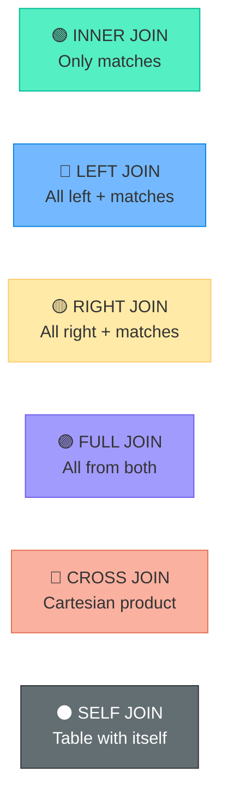

### 🎯 MCQ Focus Section
- **INNER JOIN** returns only **matching** rows from both tables.
- **LEFT JOIN** returns all rows from the **left** table + matching from right (NULL if no match).
- **RIGHT JOIN** returns all rows from the **right** table.
- MySQL does NOT support `FULL OUTER JOIN` — emulate with `LEFT JOIN UNION RIGHT JOIN`.
- **CROSS JOIN** produces **m × n** rows (Cartesian product).
- **SELF JOIN** = joining a table with **itself** (needs aliases).
- `JOIN` without a prefix is **INNER JOIN** by default.
- **ON** specifies the join condition. **USING(column)** can be used when column names are identical in both tables.
- JOINs are **faster** than subqueries in most cases.

---

## 📌 5.2 Subqueries

### 📘 Definition
A **Subquery** (inner query / nested query) is a `SELECT` statement embedded within another SQL statement. The inner query executes **first**, and its result is used by the outer query.

### 📖 Detailed Explanation

#### 🎯 Single-Row Subqueries

```sql
-- Employee with the highest salary
SELECT Name, Sal
FROM Employees
WHERE Sal = (SELECT MAX(Sal) FROM Employees);

-- Students in the same department as 'John'
SELECT * FROM Students
WHERE Dept_ID = (SELECT Dept_ID FROM Students WHERE First_Name = 'John');
```

#### 📋 Multi-Row Subqueries

```sql
-- IN: Students in CS or Math departments
SELECT * FROM Students
WHERE Dept_ID IN (SELECT Dept_ID FROM Departments WHERE Name IN ('CS', 'Math'));

-- ANY: Salary greater than ANY salary in Dept 1
SELECT * FROM Employees
WHERE Sal > ANY (SELECT Sal FROM Employees WHERE Dept_ID = 1);

-- ALL: Salary greater than ALL salaries in Dept 1
SELECT * FROM Employees
WHERE Sal > ALL (SELECT Sal FROM Employees WHERE Dept_ID = 1);
```

#### 🔗 Correlated Subqueries

```sql
-- Employees earning more than their department's average
SELECT E.Name, E.Sal, E.Dept_ID
FROM Employees E
WHERE E.Sal > (
    SELECT AVG(Sal) 
    FROM Employees 
    WHERE Dept_ID = E.Dept_ID    -- References outer query!
);
```

> [!NOTE]
> A **correlated subquery** references a column from the **outer query**. It executes **once per row** of the outer query (potentially slow). A non-correlated subquery executes **only once**.

#### ✅ EXISTS and NOT EXISTS

```sql
-- Departments that HAVE at least one employee
SELECT D.Name FROM Departments D
WHERE EXISTS (SELECT 1 FROM Employees E WHERE E.Dept_ID = D.ID);

-- Departments with NO employees
SELECT D.Name FROM Departments D
WHERE NOT EXISTS (SELECT 1 FROM Employees E WHERE E.Dept_ID = D.ID);
```

#### 📍 Subqueries in Different Positions

```sql
-- In SELECT (scalar subquery)
SELECT Name, Sal,
    (SELECT AVG(Sal) FROM Employees) AS Company_Avg
FROM Employees;

-- In FROM (derived table / inline view)
SELECT Dept_ID, Avg_Sal
FROM (SELECT Dept_ID, AVG(Sal) AS Avg_Sal FROM Employees GROUP BY Dept_ID) AS DeptAvg
WHERE Avg_Sal > 5000;

-- In HAVING
SELECT Dept_ID, AVG(Sal)
FROM Employees
GROUP BY Dept_ID
HAVING AVG(Sal) > (SELECT AVG(Sal) FROM Employees);
```

### 🎯 MCQ Focus Section
- A **subquery in WHERE** = most common. Can use `=`, `IN`, `ANY`, `ALL`, `EXISTS`.
- **Correlated subquery** runs **once per row** of the outer query. Performance can be poor.
- **Non-correlated subquery** runs **once** and its result is reused.
- `IN` = at least one match. `ANY` = compare with any single value. `ALL` = compare with every value.
- `> ALL(subquery)` = greater than the **maximum** value returned.
- `> ANY(subquery)` = greater than the **minimum** value returned.
- `EXISTS` returns TRUE if the subquery returns **at least one row** (doesn't care about values).
- A subquery in `FROM` is called a **derived table** (must have an alias in MySQL).

---

## 📌 5.3 Set Operations

### 📘 Definition
**Set operations** combine the results of two or more `SELECT` statements.

### 📖 Detailed Explanation

```sql
-- UNION: Combine results, remove duplicates
SELECT Name FROM Students
UNION
SELECT Name FROM Faculty;

-- UNION ALL: Combine results, keep duplicates (faster!)
SELECT Name FROM Students
UNION ALL
SELECT Name FROM Faculty;
```

| Operation | Duplicates | SQL Support |
|-----------|-----------|-------------|
| `UNION` | ❌ Removed | ✅ MySQL |
| `UNION ALL` | ✅ Kept | ✅ MySQL |
| `INTERSECT` | N/A | ❌ MySQL < 8.0.31 (use `INNER JOIN` or `EXISTS` workaround) |
| `EXCEPT` | N/A | ❌ MySQL < 8.0.31 (use `LEFT JOIN WHERE IS NULL` workaround) |

> [!TIP]
> **MySQL 8.0.31+** supports `INTERSECT` and `EXCEPT` natively. For older versions:
> ```sql
> -- INTERSECT workaround
> SELECT Name FROM Students WHERE Name IN (SELECT Name FROM Faculty);
>
> -- EXCEPT workaround
> SELECT S.Name FROM Students S
> LEFT JOIN Faculty F ON S.Name = F.Name WHERE F.Name IS NULL;
> ```

### 🎯 MCQ Focus Section
- `UNION` removes duplicates. `UNION ALL` keeps them and is **faster**.
- Both queries in `UNION` must have the **same number of columns** with **compatible types**.
- `UNION` performs an implicit `DISTINCT` — uses extra processing.
- Column names in the result come from the **first SELECT** statement.

---

## 📌 5.4 MySQL Built-in Functions

### 📘 Definition
MySQL provides a rich set of **built-in functions** for string manipulation, numeric calculations, date operations, and conditional logic.

### 📖 Detailed Explanation

#### 📝 String Functions

| Function | Purpose | Example | Result |
|----------|---------|---------|--------|
| `CONCAT(a, b)` | Join strings | `CONCAT('Hello', ' World')` | Hello World |
| `LENGTH(s)` | String length (bytes) | `LENGTH('Hello')` | 5 |
| `CHAR_LENGTH(s)` | String length (characters) | `CHAR_LENGTH('Hello')` | 5 |
| `UPPER(s)` / `LOWER(s)` | Change case | `UPPER('hello')` | HELLO |
| `TRIM(s)` | Remove leading/trailing spaces | `TRIM('  Hi  ')` | Hi |
| `SUBSTRING(s, start, len)` | Extract part of string | `SUBSTRING('Hello', 2, 3)` | ell |
| `REPLACE(s, from, to)` | Replace occurrences | `REPLACE('Hello', 'l', 'r')` | Herro |
| `INSTR(s, substr)` | Find position of substring | `INSTR('Hello', 'lo')` | 4 |
| `LEFT(s, n)` / `RIGHT(s, n)` | First/last n characters | `LEFT('Hello', 3)` | Hel |
| `REVERSE(s)` | Reverse string | `REVERSE('Hello')` | olleH |
| `LPAD(s, len, pad)` | Pad left | `LPAD('42', 5, '0')` | 00042 |

#### 🔢 Numeric Functions

| Function | Purpose | Example | Result |
|----------|---------|---------|--------|
| `ROUND(n, d)` | Round to d decimals | `ROUND(3.456, 2)` | 3.46 |
| `CEIL(n)` | Round up | `CEIL(3.2)` | 4 |
| `FLOOR(n)` | Round down | `FLOOR(3.9)` | 3 |
| `MOD(a, b)` | Remainder | `MOD(10, 3)` | 1 |
| `ABS(n)` | Absolute value | `ABS(-5)` | 5 |
| `POWER(a, b)` | a raised to power b | `POWER(2, 3)` | 8 |
| `SQRT(n)` | Square root | `SQRT(16)` | 4 |

#### 📅 Date Functions

| Function | Purpose | Example | Result |
|----------|---------|---------|--------|
| `NOW()` | Current date+time | `NOW()` | 2025-01-15 14:30:00 |
| `CURDATE()` | Current date | `CURDATE()` | 2025-01-15 |
| `DATEDIFF(a, b)` | Days between dates | `DATEDIFF('2025-12-31', '2025-01-01')` | 364 |
| `DATE_ADD(d, INTERVAL)` | Add interval | `DATE_ADD('2025-01-01', INTERVAL 1 MONTH)` | 2025-02-01 |
| `DATE_FORMAT(d, fmt)` | Format date | `DATE_FORMAT(NOW(), '%d/%m/%Y')` | 15/01/2025 |
| `YEAR(d)` / `MONTH(d)` | Extract parts | `YEAR('2025-01-15')` | 2025 |
| `DAYNAME(d)` | Day name | `DAYNAME('2025-01-15')` | Wednesday |

#### 🔀 Conditional Functions

```sql
-- IF(condition, true_value, false_value)
SELECT Name, IF(GPA >= 3.5, 'Honors', 'Regular') AS Category FROM Students;

-- IFNULL(value, default_if_null)
SELECT Name, IFNULL(Email, 'No email') FROM Students;

-- NULLIF(a, b) — returns NULL if a = b, else returns a
SELECT NULLIF(10, 10);  -- NULL
SELECT NULLIF(10, 20);  -- 10

-- COALESCE(v1, v2, v3, ...) — returns first non-NULL value
SELECT COALESCE(Phone, Email, 'No contact') AS Contact FROM Students;

-- CASE WHEN (the most powerful)
SELECT Name, GPA,
    CASE
        WHEN GPA >= 3.7 THEN '🏆 Distinction'
        WHEN GPA >= 3.0 THEN '✅ First Class'
        WHEN GPA >= 2.0 THEN '📗 Second Class'
        ELSE '⚠️ Below Average'
    END AS Grade_Category
FROM Students;
```

### 🎯 MCQ Focus Section
- `CONCAT()` joins strings. `LENGTH()` returns byte count. `CHAR_LENGTH()` returns character count.
- `ROUND(3.455, 2)` = **3.46**. `CEIL(3.1)` = **4**. `FLOOR(3.9)` = **3**.
- `NOW()` returns date+time. `CURDATE()` returns date only.
- `DATEDIFF()` returns the **number of days** between two dates.
- `IFNULL(x, y)` returns **y** if x is NULL, else **x**.
- `COALESCE()` returns the **first non-NULL** value from a list.
- `CASE WHEN` is the SQL equivalent of **if-else if-else** logic.

---

## 📌 5.5 Views

### 📘 Definition
A **View** is a **virtual table** based on a stored SELECT query. It does not store data itself — it dynamically fetches data from underlying tables when queried.

### 📖 Detailed Explanation

```sql
-- Create a view
CREATE VIEW Active_Students AS
SELECT Student_ID, First_Name, Last_Name, GPA
FROM Students
WHERE Is_Active = TRUE;

-- Query the view (just like a table)
SELECT * FROM Active_Students WHERE GPA > 3.5;

-- Create or replace
CREATE OR REPLACE VIEW Active_Students AS
SELECT Student_ID, First_Name, Last_Name, GPA, Dept_ID
FROM Students
WHERE Is_Active = TRUE;

-- Drop the view
DROP VIEW Active_Students;
DROP VIEW IF EXISTS Active_Students;
```

#### ✏️ Updatable vs Non-Updatable Views

| Type | Can INSERT/UPDATE/DELETE? | Conditions |
|------|--------------------------|-----------|
| **Updatable** | ✅ Yes | Simple single-table view, no aggregates, no DISTINCT, no GROUP BY, no UNION, no subqueries in SELECT |
| **Non-Updatable** | ❌ No | Uses JOINs, aggregates, DISTINCT, GROUP BY, HAVING, UNION, subqueries |

```sql
-- WITH CHECK OPTION — prevents inserting/updating rows that don't satisfy the view's WHERE
CREATE VIEW Honor_Students AS
SELECT * FROM Students WHERE GPA >= 3.7
WITH CHECK OPTION;

-- This will FAIL:
INSERT INTO Honor_Students (First_Name, GPA) VALUES ('Test', 2.0);
-- Error: CHECK OPTION failed — GPA 2.0 doesn't satisfy GPA >= 3.7
```

#### 💡 Why Use Views?

| Benefit | Explanation |
|---------|-------------|
| 🔐 **Security** | Expose only specific columns/rows to certain users |
| 🧹 **Simplicity** | Complex queries stored as simple view names |
| 📊 **Abstraction** | Hide table structure from application code |
| 🔄 **Consistency** | Common queries defined once, reused everywhere |

### 🎯 MCQ Focus Section
- A view is a **virtual table** — does NOT store data.
- A view is defined by a **stored SELECT query**.
- **Updatable views** must be simple — single table, no aggregates, no DISTINCT.
- `WITH CHECK OPTION` ensures inserted/updated rows satisfy the view's **WHERE** condition.
- Dropping a **base table** makes views dependent on it **invalid**.
- Views can be used in **SELECT**, **INSERT**, **UPDATE**, **DELETE** (if updatable).
- Views are stored in the **data dictionary** (not the data itself).
- **Materialized Views** (not in MySQL) store the result — act like cached tables.

---


---

# 🟪 UNIT 6: NORMALIZATION & DATABASE DESIGN

---

## 📌 6.1 Functional Dependencies

### 📘 Definition
A **Functional Dependency (FD)** is a constraint between two sets of attributes in a relation. If attribute X determines attribute Y, we write **X → Y** ("X functionally determines Y"). Knowing the value of X **uniquely determines** the value of Y.

### 📖 Detailed Explanation

#### 📝 Formal Definition
**X → Y** means: for any two tuples t1 and t2 in relation R, if `t1[X] = t2[X]`, then `t1[Y] = t2[Y]`.

#### Examples
| Scenario | FD | Explanation |
|----------|-----|------------|
| Student_ID → Name | ✅ | A student ID uniquely determines the name |
| Student_ID → Dept | ✅ | A student belongs to exactly one department |
| Dept → Student_ID | ❌ | Many students can be in the same department |
| {Student_ID, Course_ID} → Grade | ✅ | A student gets one grade per course |

#### 🔹 Types of Functional Dependencies

| Type | Definition | Example |
|------|-----------|---------|
| **Trivial FD** | Y ⊆ X (right side is subset of left) | {A, B} → A (always true, uninteresting) |
| **Non-Trivial FD** | Y ⊄ X (at least one attribute on right is NOT in leftFD) | A → B (meaningful dependency) |
| **Completely Non-Trivial** | X ∩ Y = ∅ (no overlap) | A → B where A ≠ B |

#### ⚙️ Armstrong's Axioms

> [!IMPORTANT]
> **Armstrong's Axioms** are **sound and complete** — they can derive ALL valid functional dependencies from a given set.

| Axiom | Rule | Example |
|-------|------|---------|
| **Reflexivity** | If Y ⊆ X, then X → Y | {A, B} → A ✅ (trivial) |
| **Augmentation** | If X → Y, then XZ → YZ | If A → B, then AC → BC |
| **Transitivity** | If X → Y and Y → Z, then X → Z | If A → B and B → C, then A → C |

Additional derived rules:
- **Union**: If X → Y and X → Z, then X → YZ
- **Decomposition**: If X → YZ, then X → Y and X → Z
- **Pseudo-Transitivity**: If X → Y and WY → Z, then WX → Z

#### 🔍 Attribute Closure (X⁺)
The **closure** of a set of attributes X (denoted X⁺) is the set of **all attributes** that can be functionally determined by X using the given FDs.

**Algorithm:**
1. Start with X⁺ = X.
2. For each FD (A → B): if A ⊆ X⁺, add B to X⁺.
3. Repeat until X⁺ doesn't change.

```
Given: R(A, B, C, D, E)
FDs: A → B, B → C, A → D, D → E

Find A⁺:
  Start: A⁺ = {A}
  A → B:  A⁺ = {A, B}
  B → C:  A⁺ = {A, B, C}
  A → D:  A⁺ = {A, B, C, D}
  D → E:  A⁺ = {A, B, C, D, E} ← ALL attributes!
  
∴ A is a candidate key (its closure = all attributes)
```

> [!TIP]
> **Finding Candidate Keys**: Compute the closure of each attribute (or combination). If the closure = ALL attributes of the relation → it's a **super key**. If removing any attribute from it breaks this → it's a **candidate key**.

### ✨ Key Points / Highlights
- 📌 X → Y means X uniquely determines Y.
- 📌 Armstrong's Axioms: Reflexivity, Augmentation, Transitivity.
- 📌 **Closure** (X⁺) = all attributes determined by X.
- 📌 If X⁺ = all attributes → X is a **super key**.

### 🎯 MCQ Focus Section
- **Trivial FD**: Right side ⊆ Left side. Always holds.
- **Armstrong's Axioms** are **sound** (only produce correct FDs) and **complete** (can produce ALL correct FDs).
- **Transitivity**: A → B, B → C ⟹ A → C.
- **Closure** X⁺ is used to find **candidate keys** and check if FDs are implied.
- If X⁺ = all attributes, X is a **super key**. If X is minimal, it's a **candidate key**.
- **Minimal cover** (canonical cover) = simplified set of FDs with no redundancy.

---

## 📌 6.2 Normal Forms

### 📘 Definition
**Normalization** is the process of organizing a relational database to **reduce redundancy** and **eliminate anomalies** (insertion, update, deletion anomalies). Each **normal form** adds stricter rules.

### 📖 Detailed Explanation


#### 1️⃣ First Normal Form (1NF)
**Rule**: All attributes must contain **atomic (indivisible) values**. No repeating groups. No multi-valued attributes in a single column.

| ❌ Violates 1NF | ✅ Satisfies 1NF |
|-----------------|------------------|
| Student: (ID, Name, Phones: "111, 222") | Student: (ID, Name) + Student_Phones: (ID, Phone) |
| Course: (ID, Title, Topics: "DB, SQL, ER") | Course: (ID, Title) + Course_Topics: (ID, Topic) |

#### 2️⃣ Second Normal Form (2NF)
**Rule**: 1NF + **no partial dependency**. Every non-key attribute must depend on the **entire** composite primary key, not just part of it.

> [!NOTE]
> **Partial dependency** only occurs when the primary key is a **composite key** (2+ attributes). If the PK is a single attribute, the table is automatically in 2NF (if it's in 1NF).

```
❌ Violates 2NF:
  Table: Enrollment(Student_ID, Course_ID, Student_Name, Grade)
  PK = (Student_ID, Course_ID)
  
  Student_Name depends on Student_ID ONLY (partial dependency!)
  Grade depends on (Student_ID, Course_ID) — OK

✅ Fix: Split into:
  Students(Student_ID, Student_Name)
  Enrollment(Student_ID, Course_ID, Grade)
```

#### 3️⃣ Third Normal Form (3NF)
**Rule**: 2NF + **no transitive dependency**. Non-key attributes must NOT depend on other non-key attributes.

```
❌ Violates 3NF:
  Table: Students(Student_ID, Name, Dept_ID, Dept_Name)
  
  Student_ID → Dept_ID → Dept_Name (transitive dependency!)
  Dept_Name depends on Dept_ID, not directly on Student_ID.

✅ Fix: Split into:
  Students(Student_ID, Name, Dept_ID)
  Departments(Dept_ID, Dept_Name)
```

> **3NF formal definition**: A relation is in 3NF if for every non-trivial FD X → Y, at least one of the following holds:
> 1. X is a **superkey**, OR
> 2. Y is part of some **candidate key** (prime attribute)

#### 🅱️ Boyce-Codd Normal Form (BCNF)
**Rule**: For every non-trivial FD X → Y, X must be a **superkey**. (Stricter than 3NF — removes the prime attribute exception.)

```
❌ In 3NF but NOT in BCNF:
  Table: Teaching(Student, Course, Instructor)
  FDs: {Student, Course} → Instructor
       Instructor → Course
  
  Candidate Keys: {Student, Course} and {Student, Instructor}
  
  Instructor → Course: Instructor is NOT a superkey → violates BCNF!
  But Course is a prime attribute → satisfies 3NF.

✅ Fix: Split into:
  StudentInstructor(Student, Instructor)
  InstructorCourse(Instructor, Course)
```

#### 4️⃣ Fourth Normal Form (4NF)
**Rule**: BCNF + **no multi-valued dependencies** (MVD).

A **multi-valued dependency** X ↠ Y exists when: for a given X, there are multiple independent Y values, regardless of other attributes.

```
❌ Violates 4NF:
  Table: EmpSkillLang(Emp_ID, Skill, Language)
  Skills and Languages are INDEPENDENT multi-valued facts about an employee.
  Emp_ID ↠ Skill and Emp_ID ↠ Language

✅ Fix: Split into:
  EmpSkills(Emp_ID, Skill)
  EmpLanguages(Emp_ID, Language)
```

#### 5️⃣ Fifth Normal Form (5NF)
**Rule**: 4NF + **no join dependencies** that aren't implied by candidate keys. Ensures lossless decomposition in all cases. Rarely needed in practice.

### ✨ Key Points / Highlights

| NF | Rule | Eliminates |
|----|------|------------|
| **1NF** | Atomic values only | Repeating groups |
| **2NF** | 1NF + no partial dependency | Partial dependency |
| **3NF** | 2NF + no transitive dependency | Transitive dependency |
| **BCNF** | Every determinant is a superkey | Remaining anomalies from 3NF |
| **4NF** | BCNF + no multi-valued dependency | Multi-valued dependency |
| **5NF** | No join dependency | Join dependency |

### 🎯 MCQ Focus Section
- **1NF**: No multi-valued attributes. All values must be **atomic**.
- **2NF**: No **partial dependency** on a composite key.
- **3NF**: No **transitive dependency** (non-key → non-key).
- **BCNF**: Every determinant (left side of FD) must be a **superkey**.
- Every **BCNF** relation is in 3NF. NOT every 3NF relation is in BCNF.
- If a relation has only **single-attribute** candidate keys → 3NF = BCNF.
- **Partial dependency** can only exist with **composite keys**.
- **3NF** allows a non-superkey determinant if the dependent attribute is a **prime attribute**. BCNF does NOT allow this.
- In practice, most databases are normalized to **3NF or BCNF**.

---

## 📌 6.3 Decomposition

### 📘 Definition
**Decomposition** is the process of splitting a relation into smaller relations to achieve a higher normal form while preserving data and dependencies.

### 📖 Detailed Explanation

#### 🔄 Lossless-Join Decomposition
- When you decompose R into R1 and R2, you must be able to **reconstruct the original** by joining them.
- **R1 ⋈ R2 = R** (no extra tuples, no lost tuples).
- **Test**: Decomposition of R into R1 and R2 is lossless if: `R1 ∩ R2 → R1` OR `R1 ∩ R2 → R2` (the common attributes must be a key in at least one of the decomposed relations).

#### 📋 Dependency-Preserving Decomposition
- All original FDs should be **enforceable** in the decomposed relations.
- You should be able to check all constraints **without joining** the decomposed tables back.

> [!WARNING]
> **BCNF decomposition** is always **lossless** but may NOT always be **dependency-preserving**.
> **3NF decomposition** (via synthesis algorithm) is always **both lossless and dependency-preserving**.
> This is why some designs choose 3NF over BCNF.

### 🎯 MCQ Focus Section
- **Lossless decomposition**: R1 ⋈ R2 = R exactly (no spurious tuples).
- **Dependency preservation**: All FDs can be checked without joining.
- **BCNF**: Always lossless. May NOT preserve dependencies.
- **3NF**: Always lossless AND dependency-preserving (using synthesis algorithm).
- Common attributes in the decomposition must be a **key** in at least one sub-relation for lossless join.

---

## 📌 6.4 Denormalization

### 📘 Definition
**Denormalization** is the intentional process of **introducing redundancy** back into a normalized database to **improve read performance**.

### 📖 Detailed Explanation

#### 🎯 When to Denormalize
- Heavy **read workloads** (reporting, analytics, dashboards).
- **JOIN-heavy** queries that are slow — precompute and store the joined data.
- **Data warehousing** and OLAP systems (star schema, snowflake schema).

#### ⚖️ Trade-offs

| Aspect | Normalized | Denormalized |
|--------|-----------|-------------|
| **Redundancy** | ✅ Minimal | ❌ Intentional |
| **Write Performance** | ✅ Fast (update one place) | ❌ Slow (update multiple copies) |
| **Read Performance** | ❌ Requires JOINs (slower) | ✅ Pre-joined data (faster) |
| **Data Integrity** | ✅ High | ⚠️ Risk of inconsistency |
| **Storage** | ✅ Less | ❌ More |

#### 🛠️ Denormalization Techniques
- **Materialized Views**: Precomputed query results stored as a table. Periodically refreshed.
- **Summary Tables**: Store aggregated data (e.g., daily sales totals).
- **Duplicating Columns**: Copy a frequently needed column into another table to avoid JOINs.
- **Pre-computed Joins**: Store joined data in a single table.

> [!TIP]
> **Rule**: Always **normalize first**, then denormalize **selectively** based on measured performance bottlenecks. Don't denormalize prematurely.

### 🎯 MCQ Focus Section
- Denormalization trades **data integrity** for **read performance**.
- **OLTP** systems (banking, e-commerce) → prefer **normalized** designs.
- **OLAP** systems (analytics, reporting) → prefer **denormalized** designs.
- **Materialized views** are a form of denormalization — store precomputed results.
- Denormalization increases **write complexity** and **storage requirements**.

---

---

# 🟫 UNIT 7: TRANSACTIONS, CONCURRENCY & STORAGE

---

## 📌 7.1 Transactions

### 📘 Definition
A **Transaction** is a **logical unit of work** consisting of one or more SQL operations that must be executed as a **single, indivisible unit**. Either ALL operations succeed (**commit**) or ALL fail (**rollback**).

### 📖 Detailed Explanation

#### ⚡ ACID Properties

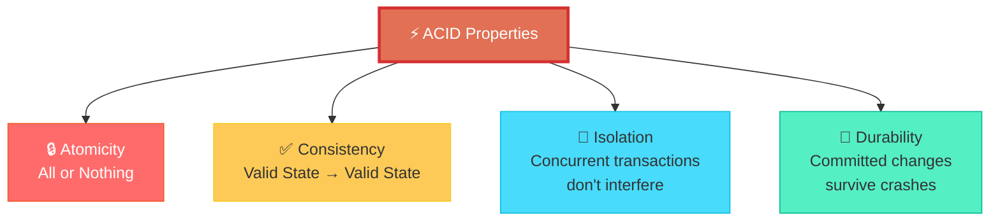

| Property | Meaning | Example |
|----------|---------|---------|
| 🔒 **Atomicity** | Transaction is **all-or-nothing** — if any part fails, the entire transaction is rolled back | Bank transfer: debit AND credit must both succeed or neither happens |
| ✅ **Consistency** | Transaction moves the database from one **valid state** to another, maintaining all constraints | Total money before = total money after a transfer |
| 🔐 **Isolation** | Concurrent transactions execute as if they were **serial** (one after another) | Two users withdrawing from the same account don't interfere |
| 💾 **Durability** | Once committed, changes are **permanent** even if the system crashes | After COMMIT, the data survives power failure |

#### 🔧 Transaction Control in MySQL

```sql
-- Start a transaction
START TRANSACTION;  -- or BEGIN;

-- Perform operations
UPDATE Accounts SET Balance = Balance - 500 WHERE Account_ID = 1;
UPDATE Accounts SET Balance = Balance + 500 WHERE Account_ID = 2;

-- If all OK → Commit
COMMIT;

-- If something wrong → Rollback
ROLLBACK;

-- Savepoint — partial rollback
START TRANSACTION;
UPDATE Accounts SET Balance = Balance - 100 WHERE Account_ID = 1;
SAVEPOINT sp1;
UPDATE Accounts SET Balance = Balance - 200 WHERE Account_ID = 1;
ROLLBACK TO sp1;  -- Undo only the second update
COMMIT;            -- First update is committed

-- Autocommit mode
SET autocommit = 0;  -- Disable (every statement needs explicit COMMIT)
SET autocommit = 1;  -- Enable (default — every statement auto-commits)
```

> [!IMPORTANT]
> In MySQL, **autocommit is ON by default**. Every individual SQL statement is automatically committed. To use transactions, either `SET autocommit = 0` or use `START TRANSACTION`.

#### Transaction States

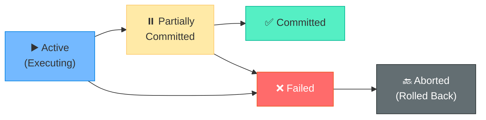

### 🎯 MCQ Focus Section
- **Atomicity** = all or nothing. Ensured by the **recovery system** (undo/redo logs).
- **Consistency** = maintained by integrity constraints and the application logic.
- **Isolation** = ensured by the **concurrency control** system.
- **Durability** = ensured by the **recovery system** (write-ahead logging).
- `COMMIT` makes changes **permanent**. `ROLLBACK` undoes all changes since last COMMIT/BEGIN.
- `SAVEPOINT` creates a named point to which you can `ROLLBACK TO`.
- **DDL** statements (CREATE, DROP, ALTER) cause an **implicit COMMIT** in MySQL.
- **Autocommit** is **ON** by default in MySQL.

---

## 📌 7.2 Concurrency Control

### 📘 Definition
**Concurrency Control** manages **simultaneous access** to the database by multiple transactions, ensuring data consistency and isolation.

### 📖 Detailed Explanation

#### ⚠️ Concurrency Problems

| Problem | Description | Example |
|---------|-------------|---------|
| 🔴 **Dirty Read** | Transaction reads data written by an **uncommitted** transaction (that might rollback) | T1 updates balance to 500. T2 reads 500. T1 rolls back. T2 has stale data |
| 🟡 **Non-Repeatable Read** | A transaction reads the same row twice and gets **different values** (another transaction modified it) | T1 reads balance=1000. T2 updates to 500. T1 reads again → 500 |
| 🟠 **Phantom Read** | A transaction re-runs a query and sees **new rows** that didn't exist before (another transaction inserted them) | T1 counts 10 students. T2 inserts a student. T1 counts again → 11 |
| ⚫ **Lost Update** | Two transactions update the same row — one update **overwrites** the other | T1 and T2 both read balance=1000. T1 sets 900. T2 sets 800. T1's update is lost |

#### 🛡️ Isolation Levels

| Level | Dirty Read | Non-Repeatable Read | Phantom Read | Performance |
|-------|-----------|--------------------|--------------| ------------|
| `READ UNCOMMITTED` | ❌ Possible | ❌ Possible | ❌ Possible | ⚡ Fastest |
| `READ COMMITTED` | ✅ Prevented | ❌ Possible | ❌ Possible | Fast |
| `REPEATABLE READ` ⭐ | ✅ Prevented | ✅ Prevented | ❌ Possible* | Balanced |
| `SERIALIZABLE` | ✅ Prevented | ✅ Prevented | ✅ Prevented | 🐌 Slowest |

> *MySQL's InnoDB `REPEATABLE READ` also prevents phantom reads using **next-key locking** — making it behave almost like SERIALIZABLE.

```sql
-- Set isolation level
SET TRANSACTION ISOLATION LEVEL READ COMMITTED;

-- Check current level
SELECT @@transaction_isolation;

-- MySQL default = REPEATABLE READ
```

> [!CAUTION]
> `READ UNCOMMITTED` is almost never used in production — it allows **dirty reads** (reading uncommitted data that might not exist after a rollback). Only use for non-critical read-only analytics where approximate data is acceptable.

#### 🔐 Locks

| Lock Type | Symbol | Who Can Read? | Who Can Write? |
|-----------|--------|--------------|---------------|
| **Shared Lock (S)** | 🔵 | ✅ Everyone | ❌ Only lock holder (blocks writes) |
| **Exclusive Lock (X)** | 🔴 | ❌ Only lock holder | ❌ Only lock holder |

**Compatibility Matrix:**

|  | Shared (S) | Exclusive (X) |
|--|-----------|---------------|
| **Shared (S)** | ✅ Compatible | ❌ Conflict |
| **Exclusive (X)** | ❌ Conflict | ❌ Conflict |

#### 💀 Deadlocks
- **Deadlock**: Two or more transactions are **waiting for each other** to release locks → neither can proceed.
- MySQL **automatically detects** deadlocks and rolls back one transaction (the "victim").
- **Prevention**: Access tables in a **consistent order**, keep transactions short, use appropriate isolation levels.

#### ⚖️ Optimistic vs Pessimistic Concurrency

| Approach | Strategy | Best For |
|----------|---------|----------|
| **Pessimistic** | Lock data BEFORE accessing. Assumes conflicts are likely | High-contention workloads |
| **Optimistic** | Allow access without locking. Check for conflicts at COMMIT time. If conflict → abort and retry | Low-contention, read-heavy workloads |

### 🎯 MCQ Focus Section
- MySQL default isolation level = **REPEATABLE READ**.
- **Dirty read** = reading **uncommitted** data.
- **SERIALIZABLE** prevents ALL problems but is **slowest**.
- **Shared locks** allow concurrent reads. **Exclusive locks** block everything.
- **Deadlock** = circular wait for locks. MySQL detects and rolls back one transaction.
- **Two-Phase Locking (2PL)**: Growing phase (acquire locks) → Shrinking phase (release locks). Guarantees **serializability**.
- **2PL** can lead to **deadlocks** (unlike timestamp-based protocols).

---

## 📌 7.3 Indexing & Performance

### 📘 Definition
An **Index** is a data structure (like a book's index) that allows the DBMS to **find rows faster** without scanning the entire table. It trades **extra storage and slower writes** for **faster reads**.

### 📖 Detailed Explanation

#### 🌲 Index Types in MySQL

| Type | Structure | Used By | When To Use |
|------|-----------|---------|-------------|
| **B-Tree Index** | Balanced tree | InnoDB (default) | Equality and range queries (`=`, `<`, `>`, `BETWEEN`, `LIKE 'prefix%'`) |
| **Hash Index** | Hash table | Memory engine | Equality queries only (`=`). NOT for range queries |
| **Full-Text Index** | Inverted index | InnoDB / MyISAM | Text search (`MATCH ... AGAINST`) |

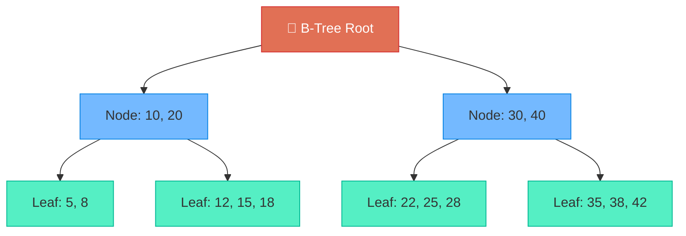

#### 🔧 Index Operations

```sql
-- Create an index
CREATE INDEX idx_gpa ON Students(GPA);

-- Create unique index
CREATE UNIQUE INDEX idx_email ON Students(Email);

-- Composite index (multi-column)
CREATE INDEX idx_dept_gpa ON Students(Dept_ID, GPA);

-- Drop index
DROP INDEX idx_gpa ON Students;

-- View indexes on a table
SHOW INDEX FROM Students;
```

#### 📊 Index Types by Purpose

| Index Type | Description | SQL |
|-----------|-------------|-----|
| **Primary Index** | Auto-created on PRIMARY KEY (clustered in InnoDB) | Automatic with PK |
| **Unique Index** | Ensures all values in the indexed column are unique | `CREATE UNIQUE INDEX` |
| **Composite Index** | Index on 2+ columns | `CREATE INDEX idx ON T(A, B, C)` |
| **Full-Text Index** | For text search on TEXT/VARCHAR columns | `CREATE FULLTEXT INDEX` |
| **Covering Index** | Index contains ALL columns needed by a query — no need to access the actual table | Design composite index to cover the query |

#### 🔍 EXPLAIN — Query Analysis

```sql
-- See how MySQL executes a query
EXPLAIN SELECT * FROM Students WHERE GPA > 3.5;

-- Key output columns:
-- type:     ALL (full scan), range, ref, eq_ref, const (best)
-- key:      Which index is used (NULL = no index)
-- rows:     Estimated rows scanned
-- Extra:    "Using index" (covering), "Using filesort", "Using temporary"
```

#### ⚖️ Index Pros and Cons

| ✅ Advantages | ❌ Disadvantages |
|--------------|-----------------|
| Dramatically faster **SELECT/WHERE/JOIN** | **Slower writes** (INSERT, UPDATE, DELETE) — index must be updated |
| Efficient **ORDER BY** and **GROUP BY** | **Extra storage** space for the index |
| Enforce **uniqueness** | **Maintenance overhead** — indexes can become fragmented |

> [!TIP]
> **Index Golden Rules:**
> 1. Index columns used in **WHERE**, **JOIN**, **ORDER BY**, **GROUP BY**.
> 2. Index columns with **high cardinality** (many unique values). Don't index Boolean columns.
> 3. Use **composite indexes** for queries that filter on multiple columns (leftmost prefix rule applies).
> 4. Don't over-index — each index slows down writes.
> 5. Use `EXPLAIN` to verify your indexes are being used.

### 🎯 MCQ Focus Section
- **B-Tree** is the default index in InnoDB — supports equality AND range queries.
- **Hash index** supports **only equality** comparisons — not ranges.
- In InnoDB, the **primary key** is the **clustered index** — data is physically ordered by PK.
- **Secondary indexes** in InnoDB point to the **primary key** (not directly to the data row).
- **Composite index** on (A, B, C) can be used for queries on: (A), (A, B), (A, B, C) — leftmost prefix rule.
- It CANNOT be used for queries on: (B), (C), (B, C) alone.
- `EXPLAIN` shows the query **execution plan** — which indexes are used, how many rows scanned.
- **Covering index**: When all columns needed by a query are in the index → no table lookup needed (very fast).
- Indexes are **NOT used** with: `LIKE '%text'` (leading wildcard), functions on indexed columns `WHERE YEAR(date_col) = 2025`, OR conditions on different columns.

---

## 📌 7.4 MySQL Storage Engines

### 📘 Definition
A **Storage Engine** is the underlying software component that MySQL uses to perform CRUD operations on data. Different engines have different features and performance characteristics.

### 📖 Detailed Explanation

| Feature | 🟢 InnoDB (Default) | 🔵 MyISAM | 🟡 Memory (HEAP) |
|---------|---------------------|-----------|-------------------|
| **Transactions** | ✅ Yes (ACID) | ❌ No | ❌ No |
| **Foreign Keys** | ✅ Yes | ❌ No | ❌ No |
| **Locking** | 🔒 Row-level | 🔒 Table-level | 🔒 Table-level |
| **Crash Recovery** | ✅ Yes (redo log) | ❌ No (corrupt risk) | ❌ No (data lost on restart) |
| **Full-Text Index** | ✅ Yes (5.6+) | ✅ Yes | ❌ No |
| **Speed (Reads)** | Fast | ⚡ Faster (simple reads) | ⚡⚡ Fastest (all in RAM) |
| **Speed (Writes)** | ⚡ Fast | Slower (table lock) | ⚡⚡ Fastest |
| **Data Storage** | Disk | Disk | **RAM only** (volatile!) |
| **Best For** | General purpose, transactions | Read-heavy, legacy apps | Temporary tables, caching |

```sql
-- Check current engine for a table
SHOW TABLE STATUS LIKE 'Students';

-- Create table with specific engine
CREATE TABLE TempData (
    ID INT PRIMARY KEY,
    Data VARCHAR(100)
) ENGINE = MEMORY;

-- Change engine
ALTER TABLE TempData ENGINE = InnoDB;
```

> [!IMPORTANT]
> **Always use InnoDB** for production databases. It supports transactions, foreign keys, row-level locking, and crash recovery. MyISAM is only useful for read-only legacy applications.

### 🎯 MCQ Focus Section
- **InnoDB** = default engine. ACID, FK, row-level locking, crash recovery.
- **MyISAM** = no transactions, no FK, table-level locking, faster simple reads.
- **Memory** = data stored in **RAM** — lost on server restart. Good for temp tables.
- **Row-level locking** (InnoDB) = better concurrency. **Table-level locking** (MyISAM) = simpler but blocks other operations.
- InnoDB uses a **clustered index** (data stored with PK). MyISAM uses **heap** storage.
- **InnoDB** supports **MVCC** (Multi-Version Concurrency Control) for non-blocking reads.

---

---

# 🟤 UNIT 8: ADVANCED MySQL — STORED PROGRAMS, SECURITY & REAL-WORLD

---

## 📌 8.1 Stored Procedures & Functions

### 📘 Definition
- A **Stored Procedure** is a precompiled set of SQL statements stored in the database, callable by name with parameters. It can perform actions but does NOT have to return a value.
- A **Stored Function** is similar but MUST return a single value and can be used in SQL expressions (like built-in functions).

### 📖 Detailed Explanation

#### 🔧 Stored Procedure

```sql
-- Change delimiter (needed because procedure body contains semicolons)
DELIMITER //

CREATE PROCEDURE GetStudentsByDept(IN dept_id INT)
BEGIN
    SELECT Student_ID, First_Name, Last_Name, GPA
    FROM Students
    WHERE Dept_ID = dept_id;
END //

DELIMITER ;

-- Call the procedure
CALL GetStudentsByDept(1);
```

#### 📝 Parameters

| Type | Direction | Description |
|------|----------|-------------|
| `IN` | → Into procedure | Input parameter (default). Caller passes value in |
| `OUT` | ← Out of procedure | Output parameter. Procedure sets value, caller reads it |
| `INOUT` | ↔ Both | Caller passes value in, procedure modifies it, caller reads the new value |

```sql
DELIMITER //

CREATE PROCEDURE GetDeptStats(
    IN dept_id INT,
    OUT student_count INT,
    OUT avg_gpa DECIMAL(3,2)
)
BEGIN
    SELECT COUNT(*), AVG(GPA)
    INTO student_count, avg_gpa
    FROM Students
    WHERE Dept_ID = dept_id;
END //

DELIMITER ;

-- Usage
CALL GetDeptStats(1, @count, @gpa);
SELECT @count AS Total, @gpa AS AvgGPA;
```

#### 🔄 Control Flow

```sql
DELIMITER //

CREATE PROCEDURE ClassifyGPA(IN student_gpa DECIMAL(3,2), OUT category VARCHAR(20))
BEGIN
    -- IF-THEN-ELSE
    IF student_gpa >= 3.7 THEN
        SET category = 'Distinction';
    ELSEIF student_gpa >= 3.0 THEN
        SET category = 'First Class';
    ELSE
        SET category = 'Needs Improvement';
    END IF;
END //

-- WHILE loop
CREATE PROCEDURE CountDown(IN start_val INT)
BEGIN
    DECLARE counter INT DEFAULT start_val;
    WHILE counter > 0 DO
        SELECT counter;
        SET counter = counter - 1;
    END WHILE;
END //

-- LOOP with LEAVE (break)
CREATE PROCEDURE LoopExample()
BEGIN
    DECLARE i INT DEFAULT 0;
    myloop: LOOP
        SET i = i + 1;
        IF i > 5 THEN
            LEAVE myloop;
        END IF;
    END LOOP myloop;
END //

DELIMITER ;
```

#### ⚡ Stored Function

```sql
DELIMITER //

CREATE FUNCTION CalculateBonus(gpa DECIMAL(3,2))
RETURNS DECIMAL(10,2)
DETERMINISTIC
BEGIN
    DECLARE bonus DECIMAL(10,2);
    IF gpa >= 3.7 THEN SET bonus = 1000.00;
    ELSEIF gpa >= 3.0 THEN SET bonus = 500.00;
    ELSE SET bonus = 0.00;
    END IF;
    RETURN bonus;
END //

DELIMITER ;

-- Use in SQL expressions (like built-in functions)
SELECT First_Name, GPA, CalculateBonus(GPA) AS Bonus FROM Students;
```

#### ⚖️ Procedure vs Function vs View

| Feature | Procedure | Function | View |
|---------|-----------|----------|------|
| **Returns** | Optional (via OUT params) | **Must return** a value | Result set (virtual table) |
| **Called with** | `CALL` | Used in **expressions** (SELECT, WHERE) | `SELECT FROM` |
| **DML allowed** | ✅ INSERT, UPDATE, DELETE | ⚠️ Limited (read-only in some contexts) | ❌ (if non-updatable) |
| **Transactions** | ✅ Can use COMMIT/ROLLBACK | ❌ Cannot | N/A |
| **Parameters** | IN, OUT, INOUT | Only **IN** | None |

```sql
-- Drop
DROP PROCEDURE IF EXISTS GetStudentsByDept;
DROP FUNCTION IF EXISTS CalculateBonus;
```

### 🎯 MCQ Focus Section
- **Procedure**: Called with `CALL`. Can have `IN`, `OUT`, `INOUT` parameters.
- **Function**: Must `RETURN` a value. Can be used in `SELECT` and `WHERE` clauses.
- `DELIMITER //` is needed because the procedure body contains `;` which MySQL interprets as statement end.
- `DETERMINISTIC` means the function always returns the same result for the same input.
- Stored procedures improve **performance** (precompiled) and **security** (encapsulate logic).

---

## 📌 8.2 Triggers

### 📘 Definition
A **Trigger** is a stored program that **automatically executes** in response to a DML event (INSERT, UPDATE, DELETE) on a specific table. It fires before or after the event.

### 📖 Detailed Explanation

```sql
DELIMITER //

-- Audit log: Track all GPA changes
CREATE TRIGGER log_gpa_change
AFTER UPDATE ON Students
FOR EACH ROW
BEGIN
    IF OLD.GPA != NEW.GPA THEN
        INSERT INTO GPA_Audit_Log (Student_ID, Old_GPA, New_GPA, Changed_At)
        VALUES (OLD.Student_ID, OLD.GPA, NEW.GPA, NOW());
    END IF;
END //

DELIMITER ;
```

#### 📋 Trigger Timing and Events

| Timing | Event | Use Case |
|--------|-------|----------|
| `BEFORE INSERT` | Before a new row is inserted | Validate/transform data before saving |
| `AFTER INSERT` | After a new row is inserted | Update audit log, sync related tables |
| `BEFORE UPDATE` | Before a row is updated | Validate new values |
| `AFTER UPDATE` | After a row is updated | Log changes, cascade updates |
| `BEFORE DELETE` | Before a row is deleted | Archive the row first |
| `AFTER DELETE` | After a row is deleted | Update counts, log deletion |

#### 🔑 NEW and OLD Keywords

| Keyword | Available In | Meaning |
|---------|-------------|---------|
| `NEW.column` | INSERT, UPDATE | The **new value** being inserted/updated |
| `OLD.column` | UPDATE, DELETE | The **old value** before update/deletion |

| Event | OLD | NEW |
|-------|-----|-----|
| INSERT | ❌ N/A | ✅ Available |
| UPDATE | ✅ Available | ✅ Available |
| DELETE | ✅ Available | ❌ N/A |

> [!WARNING]
> **Triggers can be dangerous!**
> - They execute **silently** — developers may not know they exist.
> - They can significantly **hurt performance** (extra work on every DML operation).
> - They can **cascade** in unexpected ways (trigger A fires trigger B).
> - Debug them carefully. Prefer application-level logic for complex business rules.

### 🎯 MCQ Focus Section
- Triggers fire **automatically** on DML events — you cannot call them manually.
- `NEW` = new row values (INSERT, UPDATE). `OLD` = old row values (UPDATE, DELETE).
- A `BEFORE` trigger can **modify** the `NEW` values. An `AFTER` trigger **cannot**.
- One table can have **at most one trigger** per timing+event combination (MySQL < 5.7). MySQL 5.7+ allows multiple.
- `TRUNCATE` does **NOT** fire triggers (it's DDL, not DML).
- Triggers can cause **cascading effects** and **performance issues**.

---

## 📌 8.3 Cursors

### 📘 Definition
A **Cursor** provides a mechanism to **iterate through a result set row-by-row** inside a stored procedure. It's used when you need to process each row individually (not possible with set-based SQL operations).

### 📖 Detailed Explanation

```sql
DELIMITER //

CREATE PROCEDURE ProcessStudents()
BEGIN
    -- Variables
    DECLARE done INT DEFAULT 0;
    DECLARE s_id INT;
    DECLARE s_name VARCHAR(50);
    DECLARE s_gpa DECIMAL(3,2);
    
    -- Declare cursor
    DECLARE student_cursor CURSOR FOR
        SELECT Student_ID, First_Name, GPA FROM Students WHERE Is_Active = TRUE;
    
    -- Handler for end of data
    DECLARE CONTINUE HANDLER FOR NOT FOUND SET done = 1;
    
    -- Open cursor
    OPEN student_cursor;
    
    -- Fetch loop
    read_loop: LOOP
        FETCH student_cursor INTO s_id, s_name, s_gpa;
        IF done THEN
            LEAVE read_loop;
        END IF;
        
        -- Process each row
        IF s_gpa >= 3.7 THEN
            UPDATE Students SET Bio = CONCAT('Honor student: ', s_name) 
            WHERE Student_ID = s_id;
        END IF;
    END LOOP;
    
    -- Close cursor
    CLOSE student_cursor;
END //

DELIMITER ;
```

#### 🔄 Cursor Lifecycle

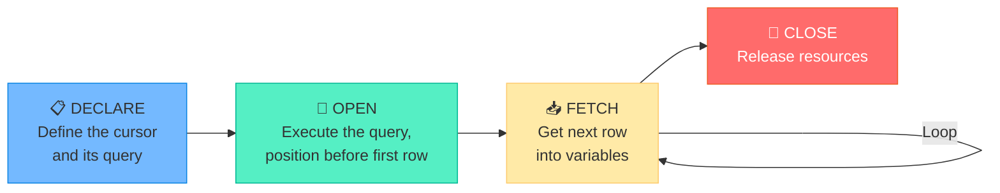

> [!CAUTION]
> **Avoid cursors when possible!** They process rows **one at a time** and are much **slower** than set-based SQL operations. Use cursors only when row-by-row processing is truly necessary (e.g., complex conditional logic per row that can't be done with CASE or JOINs).

### 🎯 MCQ Focus Section
- Cursor lifecycle: **DECLARE → OPEN → FETCH → CLOSE**.
- `CONTINUE HANDLER FOR NOT FOUND` handles the end of the result set.
- Cursors are **read-only** and **forward-only** in MySQL (no scrolling back).
- Cursors are **slow** — prefer set-based operations (JOINs, subqueries, CASE).
- Cursors can only be used inside **stored procedures** and **stored functions**.

---

## 📌 8.4 Database Security & Access Control

### 📘 Definition
**Database security** involves protecting the database from unauthorized access, misuse, and malicious attacks. MySQL provides user management, privilege control, and role-based access.

### 📖 Detailed Explanation

#### 👤 User Management

```sql
-- Create a user
CREATE USER 'john'@'localhost' IDENTIFIED BY 'SecurePass123!';
CREATE USER 'app_user'@'%' IDENTIFIED BY 'AppPass456!';  -- % = any host

-- Drop a user
DROP USER 'john'@'localhost';

-- Rename a user
RENAME USER 'john'@'localhost' TO 'john_doe'@'localhost';

-- Change password
ALTER USER 'john'@'localhost' IDENTIFIED BY 'NewPass789!';
```

#### 🔑 Privileges — GRANT and REVOKE

```sql
-- Grant specific privileges
GRANT SELECT, INSERT ON university.Students TO 'john'@'localhost';

-- Grant all privileges on a database
GRANT ALL PRIVILEGES ON university.* TO 'admin'@'localhost';

-- Grant with ability to grant others
GRANT SELECT ON university.* TO 'john'@'localhost' WITH GRANT OPTION;

-- Revoke privileges
REVOKE INSERT ON university.Students FROM 'john'@'localhost';

-- Revoke all
REVOKE ALL PRIVILEGES ON university.* FROM 'john'@'localhost';

-- View privileges
SHOW GRANTS FOR 'john'@'localhost';

-- Apply changes
FLUSH PRIVILEGES;
```

#### 🎭 Role-Based Access Control (MySQL 8+)

```sql
-- Create roles
CREATE ROLE 'read_only', 'read_write', 'admin';

-- Grant privileges to roles
GRANT SELECT ON university.* TO 'read_only';
GRANT SELECT, INSERT, UPDATE, DELETE ON university.* TO 'read_write';
GRANT ALL PRIVILEGES ON university.* TO 'admin';

-- Assign roles to users
GRANT 'read_only' TO 'john'@'localhost';
GRANT 'read_write' TO 'dev_user'@'localhost';

-- Activate roles
SET DEFAULT ROLE 'read_only' TO 'john'@'localhost';
```

> [!IMPORTANT]
> **Principle of Least Privilege**: Always grant **only the minimum permissions needed**. Don't use `GRANT ALL` unless absolutely necessary. A read-only application should only have `SELECT` privilege.

### 🎯 MCQ Focus Section
- `GRANT` gives privileges. `REVOKE` removes them.
- `'user'@'localhost'` = local access only. `'user'@'%'` = any host.
- `WITH GRANT OPTION` allows the user to grant their privileges to others.
- `FLUSH PRIVILEGES` reloads the privilege tables.
- **RBAC** (Role-Based Access Control) available in **MySQL 8+**.
- **DCL** commands: `GRANT` and `REVOKE`.
- The **root** user has all privileges — should be secured with a strong password.

---

## 📌 8.5 Backup, Recovery & Real-World Practices

### 📘 Definition
**Backup and Recovery** ensure that data can be **restored** in case of hardware failure, data corruption, accidental deletion, or other disasters.

### 📖 Detailed Explanation

#### 💾 Backup Types

| Type | Method | Tool | Use Case |
|------|--------|------|----------|
| **Logical Backup** | Export SQL statements (CREATE + INSERT) | `mysqldump` | Small to medium databases, portability |
| **Physical Backup** | Copy raw data files | `xtrabackup`, file copy | Large databases, faster restore |
| **Point-in-Time** | Replay binary logs from a backup | `mysqlbinlog` | Recover to a specific moment (e.g., just before a mistake) |

#### 🔧 mysqldump — Logical Backup

```bash
# Backup single database
mysqldump -u root -p university > university_backup.sql

# Backup all databases
mysqldump -u root -p --all-databases > all_backup.sql

# Backup specific tables
mysqldump -u root -p university Students Courses > tables_backup.sql

# Restore from backup
mysql -u root -p university < university_backup.sql
```

#### 📜 Binary Log (binlog)
- Records **all changes** to the database (INSERT, UPDATE, DELETE, DDL).
- Used for **replication** and **point-in-time recovery**.
- Combined with a full backup + replaying binlogs from that point → recover to any moment.

```sql
-- Check if binlog is enabled
SHOW VARIABLES LIKE 'log_bin';

-- Show binary log files
SHOW BINARY LOGS;
```

#### 🔄 Replication — Master-Slave / Source-Replica

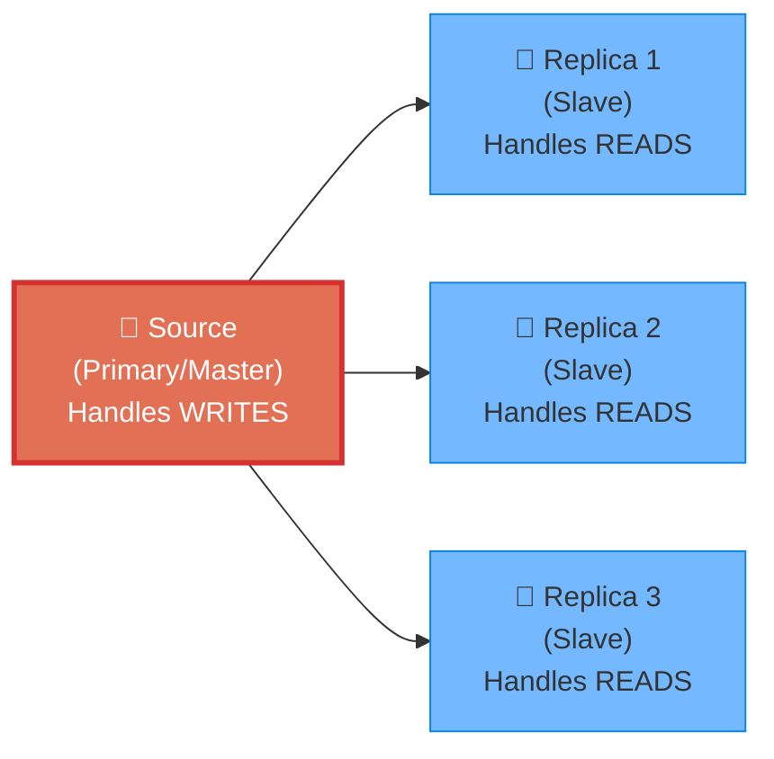

- **Source** (Master) handles all **writes**.
- **Replicas** (Slaves) receive copies of the data and handle **reads**.
- Improves **read performance** and provides **redundancy**.

#### 🚀 Query Optimization Checklist

| # | Practice | Why |
|---|---------|-----|
| 1️⃣ | **Use indexes** on WHERE, JOIN, ORDER BY columns | Avoid full table scans |
| 2️⃣ | **Use EXPLAIN** before running complex queries | See execution plan |
| 3️⃣ | **Avoid SELECT *** | Fetch only needed columns |
| 4️⃣ | **Use LIMIT** for pagination | Don't fetch millions of rows |
| 5️⃣ | **Batch operations** | INSERT multiple rows in one statement |
| 6️⃣ | **Use connection pooling** | Reuse connections instead of creating new ones |
| 7️⃣ | **Normalize properly** | Reduce redundancy |
| 8️⃣ | **Cache frequently accessed data** | Reduce database load |
| 9️⃣ | **Use prepared statements** | Prevent SQL injection + faster reuse |
| 🔟 | **Monitor slow queries** | `SET GLOBAL slow_query_log = 'ON';` |

#### 🔗 Connection Pooling
- Instead of creating a new database connection for every request → **reuse a pool** of existing connections.
- **Why**: Creating a connection is expensive (TCP handshake, authentication, memory allocation).
- Common libraries: **HikariCP** (Java), **mysql2/pool** (Node.js), **SQLAlchemy pool** (Python).
- Typical pool size: **10-50 connections** for most web applications.

### 🎯 MCQ Focus Section
- `mysqldump` performs a **logical backup** (SQL statements).
- `mysqldump` produces a `.sql` file that can be restored with the `mysql` command.
- **Binary log** records all data-modifying operations — used for replication and point-in-time recovery.
- **Replication** copies data from Source to Replica — improves read scalability.
- **Connection pooling** reuses database connections to reduce overhead.
- `EXPLAIN` shows the query execution plan — essential for optimization.
- **Prepared statements** protect against **SQL injection** attacks.
- **Slow query log** helps identify queries that take too long.

---

---

> **— End of Book —**
>
> *This comprehensive guide covers all 8 units of the DBMS & MySQL syllabus.*
> *Use it for concept building, exam revision, placement preparation, and technical interviews.*
>
> 📊 **Theory** — Understand the fundamentals
> 💻 **SQL** — Practice in a live MySQL environment
> 🎯 **MCQs** — Quick revision before exams
> 🏆 **Interviews** — Confidence through depth
>
> *Good luck!* 🎓
