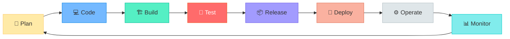
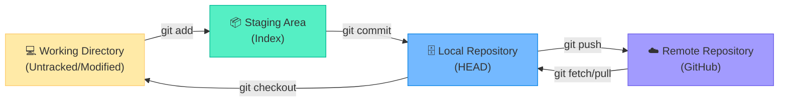
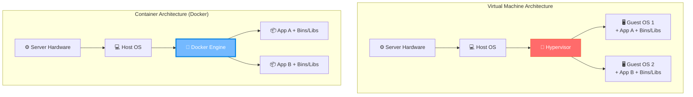
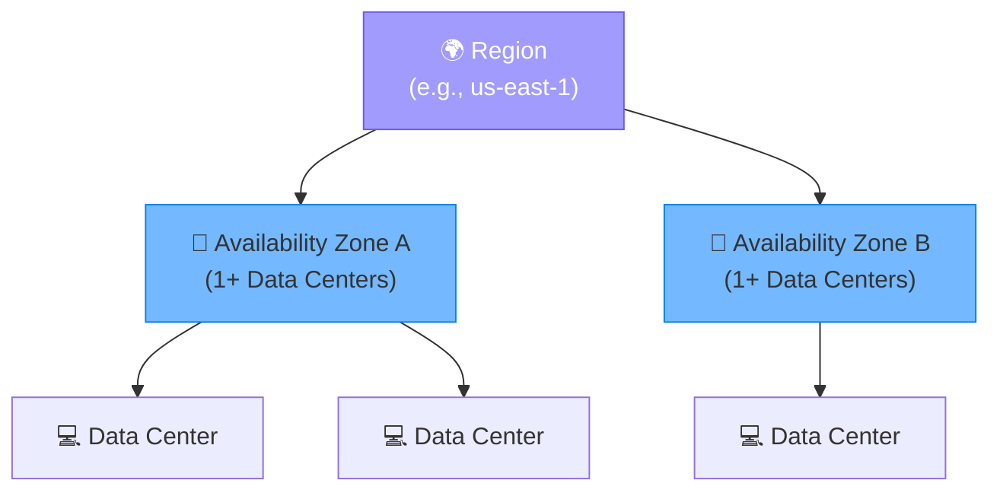
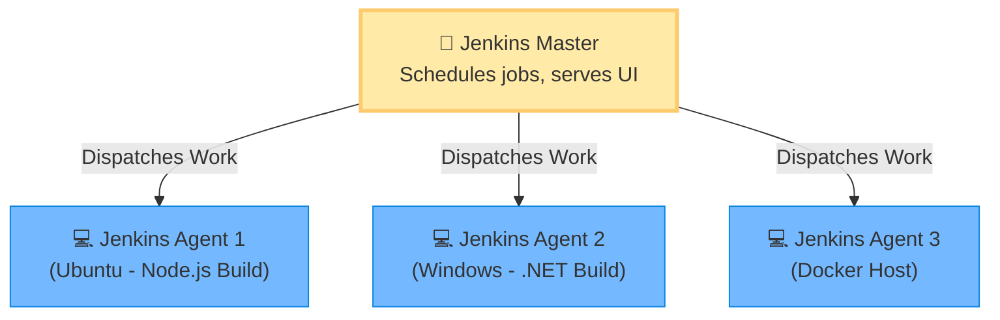

# DevOps & Cloud Computing
Comprehensive Student Syllabus | 30–40 Hour Intensive Study Plan
Prepared by Senior DevOps Engineer & Technical Recruiter
Target Audience Students — Beginner to Intermediate Level
Duration 30–40 Hours (Approx. 6–8 Sessions of 5 Hours Each)
Total Units 8 Units covering Linux, Git, Docker, AWS, Jenkins, Maven, SonarQube, Nexus, and Terraform
Goal Exam readiness + Interview confidence + Practical DevOps skills

🎯 Study Strategy: Complete each unit in sequence. Practice hands-on with a Linux VM or AWS EC2 instance. Attempt all exercises before checking answers.

---

# 🟦 UNIT 1: CI/CD AND LINUX

---

## 📌 1.1 Introduction to DevOps and CI/CD

### 📘 Definition
**DevOps** is a cultural philosophy, set of practices, and tools that integrates **software development (Dev)** and **IT operations (Ops)** to shorten the systems development life cycle and provide continuous delivery with high software quality.

**CI/CD** stands for **Continuous Integration** and **Continuous Delivery/Deployment**. It is the backbone of the DevOps methodology.

### 📖 Detailed Explanation

#### 🔄 The DevOps Pipeline



#### ⚙️ Continuous Integration vs Continuous Delivery vs Continuous Deployment

| Concept | Abbr. | Definition | Key Benefit |
|---------|-------|------------|-------------|
| **Continuous Integration** | CI | Developers merge code changes into a central repository frequently. Automated builds and tests run on every commit. | Finds bugs quickly, improves code quality, reduces integration issues. |
| **Continuous Delivery** | CD | Code changes are automatically built, tested, and prepared for production release. **Requires manual approval** to deploy. | Ensures software is always ready to be released at the push of a button. |
| **Continuous Deployment** | CD | Every change that passes all stages of the pipeline is **released automatically** to customers. No human intervention. | Accelerates feedback loop, fastest time to market. |

> [!IMPORTANT]
> The primary difference between Continuous **Delivery** and Continuous **Deployment** is the **manual approval step**. Delivery requires a human to click "Deploy", while Deployment is fully automated to production.

#### 🌟 Benefits of Automation in Software Delivery
- **Speed**: Faster release cycles (time-to-market).
- **Reliability**: Consistent and repeatable processes reduce human error.
- **Scale**: Easy to manage complex or changing systems efficiently.
- **Collaboration**: Breaks down silos between development and operations teams.
- **Security**: Automated compliance policies and fine-grained controls (DevSecOps).

### ✨ Key Points / Highlights
- 📌 DevOps bridges the gap between Dev (coding) and Ops (deployment/maintenance).
- 📌 CI/CD automates the building, testing, and deployment of applications.
- 📌 Automation reduces human error and accelerates software delivery.

### 🎯 MCQ Focus Section
- **DevOps** aims to unify software development and IT operations.
- **Continuous Integration (CI)** involves automatically building and testing code upon every commit.
- The main difference between Continuous Delivery and Continuous Deployment is the **manual approval** step before production release.
- CI/CD pipelines typically consist of **Build, Test, and Deploy** stages.

---

## 📌 1.2 Linux Basics

### 📘 Definition
**Linux** is an open-source, Unix-like operating system kernel. It is the foundation for most modern servers, containers, and DevOps tools.

### 📖 Detailed Explanation

#### 📂 Linux File System Structure
Linux uses a **hierarchical directory structure** starting from the root directory (`/`).

| Directory | Purpose | Example Contents |
|-----------|---------|------------------|
| `/` | Root directory | Top level of the file system |
| `/bin` | Essential user binaries | `ls`, `cp`, `bash` |
| `/etc` | Configuration files | `passwd`, `nginx.conf` |
| `/home` | User home directories | `/home/alice/`, `/home/bob/` |
| `/var` | Variable data files | Logs (`/var/log`), databases |
| `/tmp` | Temporary files | Deleted on reboot |
| `/usr` | User programs and utilities | Installed software |

#### 💻 Basic Linux Commands

| Category | Command | Description | Example |
|----------|---------|-------------|---------|
| **Navigation** | `pwd` | Print working directory | `pwd` |
| | `cd` | Change directory | `cd /var/log` |
| | `ls` | List directory contents | `ls -la` (all, long format) |
| **File Ops** | `touch` | Create empty file / update timestamp | `touch newfile.txt` |
| | `cp` | Copy files or directories | `cp file1.txt file2.txt` |
| | `mv` | Move or rename files | `mv oldname.txt newname.txt` |
| | `rm` | Remove files or directories | `rm -rf /dir` (force recursive) |
| | `cat` | Concatenate and print files | `cat /etc/passwd` |
| | `grep` | Search text using patterns | `grep "error" app.log` |

#### 🔐 Permissions and Ownership
Every file in Linux has an **Owner**, a **Group**, and **Others** (everyone else).
Permissions are Read (`r`), Write (`w`), and Execute (`x`).

```bash
# View permissions using ls -l
$ ls -l script.sh
-rwxr-xr-- 1 alice developers 1024 May  4 10:00 script.sh

# Breakdown:
# -         : File type (- = regular file, d = directory)
# rwx       : Owner (alice) can read, write, execute (7)
# r-x       : Group (developers) can read, execute (5)
# r--       : Others can read (4)

# Change permissions (chmod)
chmod 755 script.sh  # Owner rwx, Group r-x, Others r-x
chmod +x script.sh   # Add execute permission for all

# Change ownership (chown)
chown bob:admins file.txt  # Change owner to bob, group to admins
```

> [!TIP]
> **Numeric Permissions:**
> Read (r) = 4, Write (w) = 2, Execute (x) = 1
> 7 = 4+2+1 (rwx), 5 = 4+1 (r-x), 4 = 4 (r--)

#### ⚙️ Process Management

| Command | Purpose |
|---------|---------|
| `ps` | Report a snapshot of current processes (`ps aux` for all) |
| `top` / `htop` | Display dynamic real-time view of running processes |
| `kill <PID>` | Send a signal to a process (default is SIGTERM) |
| `kill -9 <PID>` | Force kill a process (SIGKILL) |

#### 📦 Package Management
Tools to install, update, and remove software.

| Family | Package Manager | Examples | Commands |
|--------|-----------------|----------|----------|
| **Debian/Ubuntu** | `apt` or `apt-get` | Ubuntu, Mint | `apt update`, `apt install nginx` |
| **Red Hat/CentOS** | `yum` or `dnf` | RHEL, Fedora | `yum update`, `dnf install git` |

#### 📜 Shell Basics & Scripting
A **shell script** is a text file containing a sequence of commands for a UNIX-based operating system.

```bash
#!/bin/bash
# The line above is the "shebang" - tells OS to use bash

# Environment variables
NAME="DevOps Student"
echo "Hello, $NAME!"

# Basic logic
if [ -f "/etc/passwd" ]; then
    echo "File exists."
else
    echo "File does not exist."
fi
```

#### 🌐 Networking Basics

| Command | Description |
|---------|-------------|
| `ping` | Test connectivity to a host |
| `curl` / `wget` | Transfer data from/to a server (HTTP/HTTPS) |
| `ifconfig` / `ip a` | Display network interfaces and IP addresses |
| `netstat` / `ss` | Display network connections, routing tables, ports |
| `ssh` | Securely log into a remote machine |

### ✨ Key Points / Highlights
- 📌 Root directory (`/`) is the top level of the Linux filesystem.
- 📌 File permissions use `rwx` for User, Group, and Others.
- 📌 `chmod` changes permissions; `chown` changes ownership.
- 📌 Shell scripts automate command execution, starting with a shebang (`#!/bin/bash`).

### 🎯 MCQ Focus Section
- The `/etc` directory in Linux contains **configuration files**.
- The `chmod 777` command grants **read, write, and execute** permissions to everyone.
- `ps aux` is used to list **all running processes** on a Linux system.
- `kill -9` sends a **SIGKILL** signal to forcefully terminate a process.
- The `#!/bin/bash` line in a script is called a **shebang**.
- `curl` is commonly used to test API endpoints or download files from the command line.

---

---

# 🟩 UNIT 2: GIT AND GITHUB

---

## 📌 2.1 Git Basics

### 📘 Definition
**Git** is a distributed version control system (VCS) designed to track changes in source code during software development. It allows multiple developers to collaborate on the same codebase simultaneously without overwriting each other's work.

### 📖 Detailed Explanation

#### 🌍 Why Git in DevOps?
- **History Tracking**: Who changed what, when, and why.
- **Rollbacks**: Easily revert to a previous working version if things break.
- **Branching**: Develop new features in isolated environments (branches) before merging to production code.
- **Collaboration**: Multiple developers can work on the same project globally.

#### ⚙️ Git Installation & Configuration

```bash
# Configure your identity (Crucial! Attaches to your commits)
git config --global user.name "John Doe"
git config --global user.email "johndoe@example.com"

# Check configuration
git config --list
```

#### 🔄 The 3 Trees (States) of Git



#### 💻 Common Git Commands

| Command | Action |
|---------|--------|
| `git init` | Initialize a new, empty Git repository locally |
| `git clone <url>` | Download a repository from a remote server (e.g., GitHub) |
| `git status` | Check the current state of the working directory and staging area |
| `git add <file>` | Move changes from working directory to staging area (`git add .` for all) |
| `git commit -m "msg"`| Save staged changes to the local repository with a message |
| `git log` | View commit history |

#### 🌿 Branching and Merging

Branches allow you to diverge from the main line of development and continue to do work without messing with that main line.

```bash
# Create and switch to a new branch
git checkout -b feature-login
# (Modern alternative: git switch -c feature-login)

# List branches
git branch

# Switch back to main branch
git checkout main

# Merge feature branch into main
git merge feature-login
```

> [!CAUTION]
> **Merge Conflicts** occur when Git cannot automatically resolve differences in code between two commits (e.g., two people edited the exact same line). You must manually edit the file to resolve the conflict, then `git add` and `git commit` to finalize the merge.

### ✨ Key Points / Highlights
- 📌 Git has three main states: Working Directory, Staging Area, and Local Repository.
- 📌 `git add` stages files; `git commit` saves them locally.
- 📌 Branching enables safe, isolated feature development.
- 📌 Merge conflicts require manual intervention to resolve overlapping changes.

### 🎯 MCQ Focus Section
- **Git** is a **Distributed** Version Control System (DVCS).
- `git init` creates a new local repository (creates a `.git` hidden folder).
- `git add .` stages **all** modified and new files in the current directory.
- `git status` tells you which files are modified, staged, or untracked.
- A **Merge Conflict** happens when two branches modify the same line in a file differently.

---

## 📌 2.2 GitHub & Collaboration Workflow

### 📘 Definition
**GitHub** is a cloud-based hosting service that lets you manage Git repositories. While Git is the command-line tool, GitHub provides a web-based graphical interface, collaboration features, and CI/CD integrations (GitHub Actions).

### 📖 Detailed Explanation

#### ☁️ Remote Repository Operations

```bash
# Link local repo to a remote GitHub repo
git remote add origin https://github.com/user/repo.git

# Push local commits to GitHub
git push -u origin main

# Pull latest changes from GitHub to local
git pull origin main
```

#### 🤝 Collaboration Features

| Feature | Description |
|---------|-------------|
| **Fork** | Creating a personal copy of someone else's repository on your GitHub account. |
| **Star** | Bookmarking a repository to show appreciation or track it. |
| **Issues** | Bug tracking, feature requests, and project management tasks. |
| **Pull Request (PR)** | Proposing changes you've pushed to a branch to be merged into another branch (usually `main`). Allows for code review. |

#### 🔄 Basic Collaboration Workflow (Feature Branch Workflow)
1. **Pull** latest code: `git pull origin main`
2. Create **Branch**: `git checkout -b my-feature`
3. **Make changes**, `git add`, and `git commit`
4. **Push** branch to GitHub: `git push origin my-feature`
5. Open a **Pull Request (PR)** on GitHub
6. Team performs **Code Review**
7. **Merge** PR into `main`

> [!TIP]
> **Code Review** is a critical DevOps practice. Reviewers check for bugs, coding standards, and logic errors before code hits the main branch, ensuring high quality.

### ✨ Key Points / Highlights
- 📌 Git is the tool; GitHub is the hosting platform.
- 📌 `git push` sends code up; `git pull` brings code down.
- 📌 Pull Requests (PRs) facilitate code review before merging into `main`.
- 📌 Forking is creating a copy of a repository across accounts.

### 🎯 MCQ Focus Section
- **GitHub** provides hosting for software development and version control using Git.
- `git remote add origin <URL>` connects a local repository to a remote server.
- A **Pull Request** is a request to merge code changes from one branch into another, often incorporating code review.
- `git pull` is effectively a combination of `git fetch` (download data) and `git merge` (integrate data).
- **Forking** is commonly used in open-source projects to propose changes to a project you do not have write access to.

---

---

# 🟨 UNIT 3: DOCKER

---

## 📌 3.1 Introduction to Containerization

### 📘 Definition
**Containerization** is a lightweight form of virtualization that packages an application and all its dependencies (libraries, frameworks, runtime) together into a single unit called a **container**. This ensures the application runs consistently across any computing environment.

### 📖 Detailed Explanation

#### 📦 Virtual Machines (VMs) vs Containers



| Feature | Virtual Machines | Containers |
|---------|-----------------|------------|
| **Architecture** | Includes a full Guest OS per VM | Shares the Host OS kernel |
| **Size** | Large (Gigabytes) | Small (Megabytes) |
| **Startup Time** | Slow (Minutes) | Fast (Seconds) |
| **Resource Usage**| High overhead | Low overhead (highly efficient) |
| **Isolation** | Strong (hardware level) | Moderate (process level via namespaces) |

> [!IMPORTANT]
> The primary advantage of Docker over VMs is that Docker containers **share the host OS kernel**, eliminating the need for a heavy guest OS. This makes them incredibly fast, lightweight, and portable.

### 🎯 MCQ Focus Section
- **Containers** package code and dependencies together.
- Containers share the **Host OS Kernel**, whereas VMs require a separate **Guest OS**.
- Containers are generally **faster to start** and use **fewer resources** than VMs.
- Docker is the most popular platform for containerization.

---

## 📌 3.2 Docker Architecture and Commands

### 📘 Definition
Docker operates on a **Client-Server architecture**. The Docker Client talks to the Docker Daemon (Server/Engine), which does the heavy lifting of building, running, and distributing your containers.

### 📖 Detailed Explanation

#### 🏗️ Docker Components
- **Docker Daemon (dockerd)**: The background service running on the host that manages images, containers, networks, and volumes.
- **Docker Client (docker)**: The CLI tool you use to interact with Docker (e.g., typing `docker run`).
- **Docker Image**: A read-only template with instructions for creating a Docker container.
- **Docker Container**: A runnable instance of an image.
- **Docker Registry**: Stores Docker images (e.g., **Docker Hub** is the default public registry).

#### 💻 Common Docker Commands

| Category | Command | Description |
|----------|---------|-------------|
| **Images** | `docker pull <image>` | Download an image from Docker Hub |
| | `docker images` | List local images |
| | `docker rmi <image>` | Remove an image |
| **Containers**| `docker run <image>` | Create and start a container |
| | `docker ps` | List running containers (`-a` for all) |
| | `docker stop <container>`| Gracefully stop a running container |
| | `docker rm <container>` | Remove a stopped container |
| | `docker exec -it <container> bash` | Run a command inside a running container (get a shell) |

#### 🚀 Creating and Running Containers

```bash
# Run an Nginx web server in detached mode (-d), mapping host port 8080 to container port 80 (-p)
docker run -d -p 8080:80 --name my-web-server nginx

# View logs of the container
docker logs my-web-server
```

> [!TIP]
> **Port Mapping (`-p host_port:container_port`)**: Containers run in their own isolated network. To access an application inside a container from your browser, you must map a port from your physical host machine to the container's port.

### 🎯 MCQ Focus Section
- The **Docker Daemon** creates and manages Docker objects like images and containers.
- **Docker Hub** is the default public registry for Docker images.
- `docker ps` lists running containers; `docker ps -a` lists both running and stopped ones.
- The `-d` flag in `docker run` runs the container in the **background (detached mode)**.
- `docker exec -it` is used to get an interactive terminal inside a running container.

---

## 📌 3.3 Dockerfile and Docker Compose

### 📘 Definition
A **Dockerfile** is a simple text file that contains a list of commands (instructions) the Docker daemon calls while building an image.
**Docker Compose** is a tool for defining and running multi-container Docker applications using a YAML file.

### 📖 Detailed Explanation

#### 📄 Dockerfile Basics

| Instruction | Description |
|-------------|-------------|
| `FROM` | Specifies the base image (Must be the first instruction!) |
| `WORKDIR` | Sets the working directory inside the container |
| `COPY` | Copies files from the host to the container |
| `RUN` | Executes commands during the **build** phase (e.g., installing packages) |
| `EXPOSE` | Documents which ports the container listens on |
| `ENV` | Sets environment variables |
| `CMD` | Specifies the default command to run when the container **starts** |

**Example Dockerfile for a Node.js App:**
```dockerfile
# 1. Use official Node.js image as base
FROM node:18-alpine

# 2. Set working directory
WORKDIR /app

# 3. Copy package.json and install dependencies
COPY package.json .
RUN npm install

# 4. Copy the rest of the application code
COPY . .

# 5. Expose application port
EXPOSE 3000

# 6. Command to run when container starts
CMD ["npm", "start"]
```

**Building the Custom Image:**
```bash
# Build the image and tag it as 'my-node-app', looking for Dockerfile in current dir (.)
docker build -t my-node-app:1.0 .
```

#### 💾 Volumes and Networking
- **Volumes**: Used to persist data generated by and used by Docker containers. Without volumes, data is lost when the container is deleted.
  - `docker run -v /host/path:/container/path nginx`
- **Networks**: Allow containers to communicate with each other securely in isolation.

#### 🐙 Introduction to Docker Compose
Running multiple containers (e.g., a web app and a database) manually using `docker run` is tedious. Docker Compose uses a `docker-compose.yml` file to configure application services.

**Example docker-compose.yml:**
```yaml
version: '3.8'
services:
  web:
    image: my-node-app:1.0
    ports:
      - "3000:3000"
    depends_on:
      - db
  
  db:
    image: postgres:14
    environment:
      POSTGRES_PASSWORD: mysecretpassword
    volumes:
      - db-data:/var/lib/postgresql/data

volumes:
  db-data:
```

**Docker Compose Commands:**
```bash
docker-compose up -d    # Start all services in background
docker-compose down     # Stop and remove containers, networks
```

### ✨ Key Points / Highlights
- 📌 A `Dockerfile` defines how to build a single container image.
- 📌 `FROM` must be the first instruction in a Dockerfile.
- 📌 `RUN` executes during the build; `CMD` executes when the container starts.
- 📌 `Docker Compose` manages multi-container applications via YAML.
- 📌 **Volumes** are essential for data persistence in Docker.

### 🎯 MCQ Focus Section
- The `FROM` instruction in a Dockerfile sets the **Base Image**.
- The `RUN` instruction is executed **during the image build process**.
- The `CMD` instruction provides defaults for an executing container.
- **Docker Compose** is defined using a **YAML (.yml)** file.
- **Volumes** are the preferred mechanism for persisting data generated by and used by Docker containers.

---

# 🟧 UNIT 4: AWS AND CLOUD

---

## 📌 4.1 Introduction to Cloud Computing & AWS

### 📘 Definition
**Cloud Computing** is the on-demand delivery of IT resources (compute power, database storage, applications) over the internet with pay-as-you-go pricing.

**AWS (Amazon Web Services)** is the world's most comprehensive and broadly adopted cloud platform.

### 📖 Detailed Explanation

#### ☁️ Cloud Service Models

| Model | What it is | You Manage | Provider Manages | Example |
|-------|------------|------------|------------------|---------|
| **IaaS** (Infrastructure as a Service) | Raw infrastructure (servers, storage, network) | OS, Apps, Data, Runtime | Physical hardware, virtualization | AWS EC2, S3 |
| **PaaS** (Platform as a Service) | Platform for developing/deploying apps | Apps, Data | Hardware, OS, Runtime, Middleware | AWS Elastic Beanstalk, Heroku |
| **SaaS** (Software as a Service) | Fully functional software accessed via browser | Nothing (just use it) | Everything | Gmail, Salesforce, Dropbox |

#### 🌍 AWS Global Infrastructure



- **Region**: A physical location in the world where AWS has multiple Availability Zones.
- **Availability Zone (AZ)**: One or more discrete data centers with redundant power, networking, and connectivity. Fault-tolerant.
- **Edge Locations**: Caching servers located near users to deliver content with low latency (used by CloudFront).

### 🎯 MCQ Focus Section
- **IaaS** provides the highest level of flexibility and management control over IT resources.
- A **Region** consists of multiple, isolated, and physically separate **Availability Zones**.
- **Edge Locations** are primarily used for caching content to reduce latency for end users.

---

## 📌 4.2 Core AWS Services

### 📘 Definition
Understanding the fundamental compute, storage, security, and networking services provided by AWS.

### 📖 Detailed Explanation

#### 🔐 IAM (Identity and Access Management)
Used to manage access to AWS services and resources securely. **Global service** (not region-specific).

| Component | Description |
|-----------|-------------|
| **User** | A person or service that interacts with AWS |
| **Group** | A collection of users with shared permissions |
| **Role** | Temporary credentials assumed by an AWS service (e.g., giving EC2 permission to read from S3) |
| **Policy** | JSON document defining permissions (Allow/Deny) attached to Users, Groups, or Roles |

> [!CAUTION]
> **Security Best Practice**: Never use the AWS Root Account for daily tasks. Create an IAM user with Administrator access, enable MFA (Multi-Factor Authentication), and lock away the Root credentials.

#### 💻 EC2 (Elastic Compute Cloud)
Provides secure, resizable compute capacity in the cloud (Virtual Machines).

- **AMI (Amazon Machine Image)**: A template that contains the software configuration (OS, application server, apps) required to launch an instance.
- **Key Pairs**: Public/Private key pair used to securely connect (SSH) to the instance.
- **Security Groups**: Acts as a **virtual firewall** for your instance to control inbound and outbound traffic.

#### 📦 S3 (Simple Storage Service)
Object storage service offering industry-leading scalability, data availability, security, and performance.

- **Buckets**: Containers for data stored in S3. Names must be **globally unique**.
- **Objects**: The files and metadata stored in buckets.
- **Storage Classes**: Standard, Intelligent-Tiering, Standard-IA (Infrequent Access), Glacier (Archival).

#### 💾 EBS (Elastic Block Store)
Persistent block storage volumes for use with EC2 instances. (Like a hard drive attached to your computer).

- **Snapshots**: Point-in-time backups of an EBS volume stored in S3.

#### 🌐 VPC (Virtual Private Cloud)
A logically isolated section of the AWS Cloud where you can launch AWS resources in a virtual network that you define.

| Component | Description |
|-----------|-------------|
| **Subnet** | A range of IP addresses in your VPC. (Public subnet = has internet access, Private = no internet) |
| **Internet Gateway** | Allows resources in a public subnet to connect to the internet |
| **Route Table** | Contains rules (routes) that determine where network traffic is directed |

#### ⚖️ Load Balancing and Auto Scaling
- **Elastic Load Balancer (ELB)**: Automatically distributes incoming application traffic across multiple targets (e.g., EC2 instances).
- **Auto Scaling Group (ASG)**: Automatically adjusts the number of EC2 instances in your fleet based on demand (scale out/in) to maintain performance and lower costs.

#### 📊 CloudWatch
Monitoring and observability service built for DevOps engineers.
- Collects metrics (CPU usage, network traffic).
- Monitors log files.
- Sets alarms (e.g., send an email if CPU > 80%).

### ✨ Key Points / Highlights
- 📌 IAM is global; EC2, S3 (partially), and VPC are region-specific.
- 📌 S3 bucket names must be globally unique across all AWS accounts.
- 📌 Security Groups operate at the instance level (firewall).
- 📌 EBS volumes must be in the same Availability Zone as the EC2 instance they are attached to.

### 🎯 MCQ Focus Section
- **IAM Roles** are assumed by services (like EC2) to grant temporary permissions without using access keys.
- **S3** provides **Object** storage, while **EBS** provides **Block** storage.
- A **Security Group** acts as a virtual firewall to control inbound and outbound traffic for EC2 instances.
- **Auto Scaling** ensures you have the correct number of EC2 instances available to handle the load.
- **CloudWatch** is used for monitoring AWS resources and applications.

---

---

# 🟥 UNIT 5: JENKINS

---

## 📌 5.1 Introduction to Jenkins and CI/CD Role

### 📘 Definition
**Jenkins** is an open-source automation server written in Java. It helps automate the parts of software development related to building, testing, and deploying, facilitating Continuous Integration and Continuous Delivery (CI/CD).

### 📖 Detailed Explanation

#### 🚀 Why Jenkins?
- Vast ecosystem with thousands of **plugins** (integrates with almost everything).
- Highly customizable and extensible.
- Master-Agent (Node) architecture allows distributing workloads across multiple machines.

#### ⚙️ Jenkins Architecture



- **Master**: The central server that schedules build jobs, dispatches them to agents, monitors them, and records results.
- **Agent (Slave)**: A machine (VM, physical, or container) that connects to the Master and executes the tasks assigned to it.

### 🎯 MCQ Focus Section
- Jenkins is primarily written in **Java**.
- In Jenkins architecture, the **Master** schedules jobs and serves the UI, while **Agents** execute the build tasks.
- Jenkins relies heavily on **plugins** to integrate with tools like Git, Maven, and Docker.

---

## 📌 5.2 Jenkins Jobs and Pipelines

### 📘 Definition
A **Job** (or Project) in Jenkins is a user-configured description of work which Jenkins should perform.
A **Pipeline** is a suite of plugins that supports implementing and integrating continuous delivery pipelines into Jenkins.

### 📖 Detailed Explanation

#### 📦 Types of Jenkins Projects
1. **Freestyle Project**: The classic way to build jobs. Configured through the web UI. Good for simple tasks, but hard to version control the configuration.
2. **Pipeline**: Defines the entire build process via code (Pipeline-as-Code). Configured using a `Jenkinsfile`.

#### 📜 Jenkinsfile and Declarative Pipeline
A `Jenkinsfile` is a text file that contains the definition of a Jenkins Pipeline and is checked into source control (Git).

There are two syntaxes: **Declarative** (newer, easier, more structured) and **Scripted** (older, Groovy-based, highly flexible).

**Example Declarative Pipeline:**
```groovy
pipeline {
    agent any // Run on any available agent
    
    stages {
        stage('Build') {
            steps {
                echo 'Building the application...'
                // sh 'npm install' or 'mvn clean package'
            }
        }
        stage('Test') {
            steps {
                echo 'Running unit tests...'
                // sh 'npm test'
            }
        }
        stage('Deploy') {
            steps {
                echo 'Deploying to staging server...'
                // sh './deploy.sh'
            }
        }
    }
    
    post {
        always {
            echo 'This always runs, regardless of success or failure.'
        }
        success {
            echo 'Build succeeded!'
        }
        failure {
            echo 'Build failed. Sending email alert...'
        }
    }
}
```

> [!TIP]
> **Pipeline-as-Code** (using a `Jenkinsfile`) is the industry standard. It treats the CI/CD pipeline configuration as code, meaning it is versioned, reviewed, and stored alongside the application source code.

#### ⚡ Build Triggers
How does a Jenkins job start?
- **Manual**: Clicking "Build Now".
- **Poll SCM**: Jenkins periodically checks Git for changes.
- **Webhook (Push Notification)**: GitHub tells Jenkins "I have new code, start a build!" (Best Practice).
- **Scheduled**: Run at a specific time (like a cron job).

#### 🔌 Integrations and Plugins
Jenkins integrates with:
- **Git/GitHub**: For pulling source code (requires Git plugin).
- **Maven/Gradle**: For building Java applications.
- **Docker**: To build images and run containers.
- **SonarQube**: For code quality analysis.
- **Nexus/Artifactory**: To store built artifacts.
- **Slack/Email**: For notifications in post-build actions.

### ✨ Key Points / Highlights
- 📌 A `Jenkinsfile` defines Pipeline-as-Code.
- 📌 Declarative pipelines use a strict `pipeline { stages { stage { steps {} } } }` block structure.
- 📌 Webhooks are the most efficient way to trigger Jenkins builds from GitHub.
- 📌 The `post` block executes actions after the pipeline stages complete (e.g., notifications).

### 🎯 MCQ Focus Section
- A **Jenkinsfile** is used to define Pipeline-as-Code.
- **Declarative Pipeline** provides a more structured and simpler syntax compared to Scripted Pipeline.
- A **Webhook** is the most efficient build trigger, pushing an event from GitHub to Jenkins immediately when code is committed.
---

# 🟪 UNIT 6: MAVEN

---

## 📌 6.1 Build Tools and Maven Basics

### 📘 Definition
**Maven** is a popular open-source build automation and project management tool primarily used for Java projects. It standardizes the build process and manages project dependencies.

### 📖 Detailed Explanation

#### 🛠️ Why Use a Build Tool?
Without a build tool, developers have to manually:
1. Download JAR files (libraries) and add them to the classpath.
2. Compile Java code (`javac`).
3. Run tests.
4. Package the code into a JAR/WAR file.
Maven automates all of this using a declarative configuration file.

#### 📄 The POM File (pom.xml)
The **Project Object Model (POM)** is the core of a Maven project. It is an XML file that contains information about the project and configuration details used by Maven to build the project.

**Key elements in pom.xml:**
- **Group ID (`groupId`)**: Uniquely identifies your project across all projects (e.g., `com.mycompany.app`).
- **Artifact ID (`artifactId`)**: The name of the jar without version (e.g., `my-app`).
- **Version (`version`)**: The version of your project (e.g., `1.0-SNAPSHOT`).
- **Dependencies (`dependencies`)**: List of external libraries your project needs.

#### 📦 Dependency Management & Repositories
When you declare a dependency in `pom.xml` (like Spring Boot or JUnit), Maven automatically downloads it.
- **Local Repository**: A directory on your local machine (`~/.m2/repository`) where Maven caches downloaded dependencies.
- **Central Repository**: The default public repository provided by the Maven community.
- **Remote/Corporate Repository**: A private repository (like **Nexus** or Artifactory) hosted within a company.

#### 🔄 Maven Build Lifecycle
Maven is based on the central concept of a **build lifecycle**. Each lifecycle consists of a sequence of **phases**.

| Phase | Description | Command |
|-------|-------------|---------|
| **clean** | Deletes the `target` directory (cleans up previous builds). | `mvn clean` |
| **validate**| Validates if the project is correct and all necessary information is available. | `mvn validate` |
| **compile** | Compiles the source code of the project. | `mvn compile` |
| **test** | Tests the compiled source code using a suitable unit testing framework (like JUnit). | `mvn test` |
| **package** | Takes the compiled code and packages it in its distributable format (e.g., JAR/WAR). | `mvn package` |
| **install** | Installs the package into the local repository for use as a dependency in other projects locally. | `mvn install` |
| **deploy** | Done in the build environment; copies the final package to the remote repository. | `mvn deploy` |

> [!NOTE]
> Executing a phase executes all preceding phases sequentially. For example, running `mvn install` will automatically run validate, compile, test, and package before it installs.

### ✨ Key Points / Highlights
- 📌 `pom.xml` is the heart of a Maven project.
- 📌 Dependencies are downloaded from Remote -> Local repository.
- 📌 The `target` folder contains all the compiled classes and packaged artifacts (JAR/WAR).
- 📌 `mvn clean package` is the most common command to build a fresh artifact.

### 🎯 MCQ Focus Section
- The core configuration file in Maven is called **`pom.xml`**.
- Maven downloads dependencies from the **Central Repository** and caches them in the **Local Repository**.
- The **`package`** phase creates the JAR or WAR file.
- The **`clean`** phase removes files generated by previous builds (the `target` directory).

---

---

# 🟫 UNIT 7: SONARQUBE AND NEXUS

---

## 📌 7.1 SonarQube: Code Quality

### 📘 Definition
**SonarQube** is an open-source platform developed by SonarSource for continuous inspection of code quality. It performs automatic reviews with **Static Code Analysis** to detect bugs, code smells, and security vulnerabilities.

### 📖 Detailed Explanation

#### 🔍 Static Code Analysis
Analyzing source code *without* executing it. It checks the code against a set of rules (coding standards, best practices, security flaws) before it even reaches the testing phase.

#### 📊 SonarQube Metrics

| Metric | Description |
|--------|-------------|
| **Bugs** | Coding errors that will cause the code to break or behave incorrectly. (Must fix immediately) |
| **Vulnerabilities** | Security flaws that hackers could exploit (e.g., SQL injection risks). |
| **Code Smells** | Code that is confusing, hard to maintain, or poorly designed (technical debt). Not an error, but a bad practice. |
| **Coverage** | The percentage of code covered by unit tests. |
| **Duplications** | Blocks of code that are duplicated across the project. |

#### 🚪 Quality Gates and Profiles
- **Quality Profile**: A collection of rules (e.g., "Java Clean Code Rules") applied during the analysis.
- **Quality Gate**: A set of boolean conditions (pass/fail criteria) based on metrics. For example, a Quality Gate might say: *"Fail the build if Code Coverage < 80% OR Critical Bugs > 0"*.

> [!TIP]
> In a CI/CD pipeline, if the SonarQube analysis fails the Quality Gate, the Jenkins pipeline should immediately stop and prevent deployment to production.

---

## 📌 7.2 Nexus: Artifact Repository

### 📘 Definition
**Sonatype Nexus Repository Manager** is an artifact repository that stores, organizes, and distributes software components (artifacts) created during the build process or downloaded from public repositories.

### 📖 Detailed Explanation

#### 📦 Why use an Artifact Repository?
- **Speed**: Caches public dependencies (like Maven Central or npm) locally so developers and CI servers don't have to download them from the internet every time.
- **Sharing**: Allows teams to publish internal libraries (e.g., `company-auth-lib.jar`) so other teams can consume them easily.
- **Releases**: Stores the final, versioned build artifacts (JAR, WAR, Docker images) ready for deployment.

#### 🗂️ Types of Nexus Repositories
1. **Proxy Repository**: Acts as a caching proxy for a remote public repository (e.g., Maven Central, Docker Hub).
2. **Hosted Repository**: Stores artifacts built internally by your organization. Usually split into:
   - `releases`: For stable, production-ready artifacts (e.g., `v1.0.0`). Cannot be overwritten.
   - `snapshots`: For artifacts under active development (e.g., `v1.1.0-SNAPSHOT`). Can be updated frequently.
3. **Group Repository**: Combines multiple repositories (proxy + hosted) under a single URL for easier configuration in tools like Maven.

### ✨ Key Points / Highlights
- 📌 SonarQube checks **code quality** (Bugs, Smells, Vulnerabilities).
- 📌 Quality Gates determine if the code is good enough to proceed in the pipeline.
- 📌 Nexus stores the final **built artifacts** and caches external dependencies.
- 📌 Proxy repositories save bandwidth and speed up builds.

### 🎯 MCQ Focus Section
- **SonarQube** performs **Static Code Analysis**.
- A **Code Smell** indicates poor design or maintainability issues, but not necessarily a functional bug.
- A **Quality Gate** is a pass/fail condition for code quality in SonarQube.
- **Nexus** is used to store and manage build artifacts.
- A **Proxy Repository** in Nexus caches artifacts from external public repositories.

---

---

# 🟤 UNIT 8: TERRAFORM

---

## 📌 8.1 Introduction to Infrastructure as Code (IaC)

### 📘 Definition
**Terraform** is an open-source Infrastructure as Code (IaC) tool created by HashiCorp. It allows you to define, provision, and manage cloud infrastructure (AWS, Azure, GCP) using a declarative configuration language (HCL - HashiCorp Configuration Language).

### 📖 Detailed Explanation

#### 🏗️ Why Terraform?
Before IaC, engineers manually clicked through the AWS console to create servers. This was slow, error-prone, and hard to replicate.
With Terraform:
- **Automation**: Provision infrastructure instantly via code.
- **Version Control**: Treat infrastructure like software (commit `.tf` files to Git).
- **Multi-Cloud**: Supports multiple cloud providers using a single workflow.

#### ⚙️ Terraform Architecture
- **Terraform Core**: Reads the configuration files and creates an execution plan.
- **Providers**: Plugins that interact with cloud APIs (e.g., AWS Provider, Azure Provider). They understand the specific resources of that platform.

#### 📝 Writing Terraform Configuration (HCL)
Terraform code is written in `.tf` files. It is declarative—you describe the *desired end state*, and Terraform figures out how to achieve it.

**Basic AWS EC2 Example (`main.tf`):**
```hcl
# 1. Configure the Provider
provider "aws" {
  region = "us-east-1"
}

# 2. Define a Resource
resource "aws_instance" "web_server" {
  ami           = "ami-0c55b159cbfafe1f0" # Amazon Linux 2 AMI
  instance_type = "t2.micro"

  tags = {
    Name = "MyTerraformServer"
  }
}
```

---

## 📌 8.2 Terraform Workflow and State

### 📘 Definition
The Terraform workflow consists of four core commands used to safely deploy infrastructure. **State** is how Terraform maps real-world cloud resources to your configuration.

### 📖 Detailed Explanation

#### 🔄 The Core Terraform Workflow

| Command | Action | Description |
|---------|--------|-------------|
| `terraform init` | **Initialize** | Prepares the working directory. Downloads the necessary **Provider plugins** (e.g., AWS plugin). |
| `terraform plan` | **Preview** | Shows an execution plan. Tells you exactly what Terraform *will* do (create, modify, delete) without actually making changes. |
| `terraform apply` | **Execute** | Executes the plan and provisions the infrastructure in the cloud. Prompts for a "yes" before proceeding. |
| `terraform destroy` | **Tear Down** | Destroys all resources managed by the current Terraform configuration. |

#### 🗄️ The State File (`terraform.tfstate`)
When you run `terraform apply`, Terraform creates a `terraform.tfstate` file.
- It acts as a database mapping your `.tf` code to the actual resources in AWS.
- If you change your code, Terraform compares the code against the state file to determine what needs to be updated.

> [!WARNING]
> **State File Security**: The state file often contains sensitive information (passwords, database URIs) in plain text. **Never commit `terraform.tfstate` to Git!** Store it remotely and securely (e.g., in an AWS S3 bucket with state locking via DynamoDB) for team collaboration.

#### 🧩 Variables and Outputs
- **Input Variables (`variable`)**: Allow you to parameterize configurations (like passing arguments to a function) so you can reuse code.
- **Outputs (`output`)**: Print useful information to the console after a successful apply (e.g., the public IP of the newly created EC2 instance).

```hcl
# Variable definition
variable "instance_type" {
  type    = string
  default = "t2.micro"
}

# Using the variable
resource "aws_instance" "web" {
  ami           = "ami-12345"
  instance_type = var.instance_type
}

# Outputting the result
output "public_ip" {
  value = aws_instance.web.public_ip
}
```

### ✨ Key Points / Highlights
- 📌 Terraform uses a declarative language (HCL).
- 📌 Providers act as the translation layer between Terraform and Cloud APIs.
- 📌 `init` -> `plan` -> `apply` is the standard safe deployment workflow.
- 📌 The State file tracks the current status of infrastructure; keep it secure and remote.

### 🎯 MCQ Focus Section
- **Terraform** is a popular **Infrastructure as Code (IaC)** tool.
- The `terraform init` command is responsible for downloading **Provider plugins**.
- `terraform plan` allows you to **preview** the changes before applying them.
- The **`terraform.tfstate`** file maps your configuration to real-world resources.
- **Providers** enable Terraform to interact with different cloud APIs like AWS, Azure, or Google Cloud.

---
